# StationFlow: A Mathematical Approach to MRT Disruption and Crowd Management

**Authors:** Qu Guanyu, Zhang Hanyu

A spectral graph analysis of Singapore's MRT network — quantifying connectivity, identifying structurally vulnerable stations, simulating disruptions, and proposing a cost-optimal infrastructure and operations package to improve network resilience.

---

## Table of Contents

1. [Overview](#1-overview)
2. [Methodology](#2-methodology)
3. [Baseline Network Connectivity](#3-baseline-network-connectivity)
4. [Station Vulnerability Analysis](#4-station-vulnerability-analysis)
5. [Disruption Simulation Results](#5-disruption-simulation-results)
6. [Monte Carlo Random Disruption Analysis](#6-monte-carlo-random-disruption-analysis)
7. [Line-Level Disruption Analysis](#7-line-level-disruption-analysis)
8. [Cost & Satisfaction Optimization](#8-cost--satisfaction-optimization)
9. [Proposed Solution](#9-proposed-solution)
10. [Post-Solution Results](#10-post-solution-results)
11. [Commuter Flow Modelling](#11-commuter-flow-modelling)
12. [Key Findings & Conclusion](#12-key-findings--conclusion)
13. [References](#13-references)

---

## 1. Overview

Singapore's MRT network carries millions of commuters daily. When a single station is disrupted, delays and crowding can propagate well beyond the point of failure. Existing analyses of the network tend to look at a single factor in isolation (e.g. crowding alone). This project instead builds an integrated mathematical model that captures **structural vulnerability**, **crowding**, and **connectivity** simultaneously, then uses simulation and optimization to test and validate concrete infrastructure proposals.

Two concepts are deliberately kept distinct throughout this report:

- **Crowded station** — a station with high passenger throughput.
- **Vulnerable station** — a station whose removal causes a large drop in the network's overall connectivity, regardless of how many people pass through it.

A station can be one, both, or neither. This distinction matters because it changes what kind of intervention is appropriate: a crowded-but-resilient station needs more capacity, while a vulnerable station needs an alternative route.

The project has two major components:

1. **Theory** — a static spectral-graph model of the network (Laplacian, eigenvalues/eigenvectors, queuing theory).
2. **Simulation & optimization** — dynamic disruption modelling (Monte Carlo, Dijkstra rerouting, Tarjan articulation points) and a cost–satisfaction Pareto search for the best set of upgrades.

---

## 2. Methodology

The MRT network is modelled as a weighted graph $G = (V, E)$, where each station is a node and each direct connection is an edge weighted by passenger volume $w_{ij}$.

| 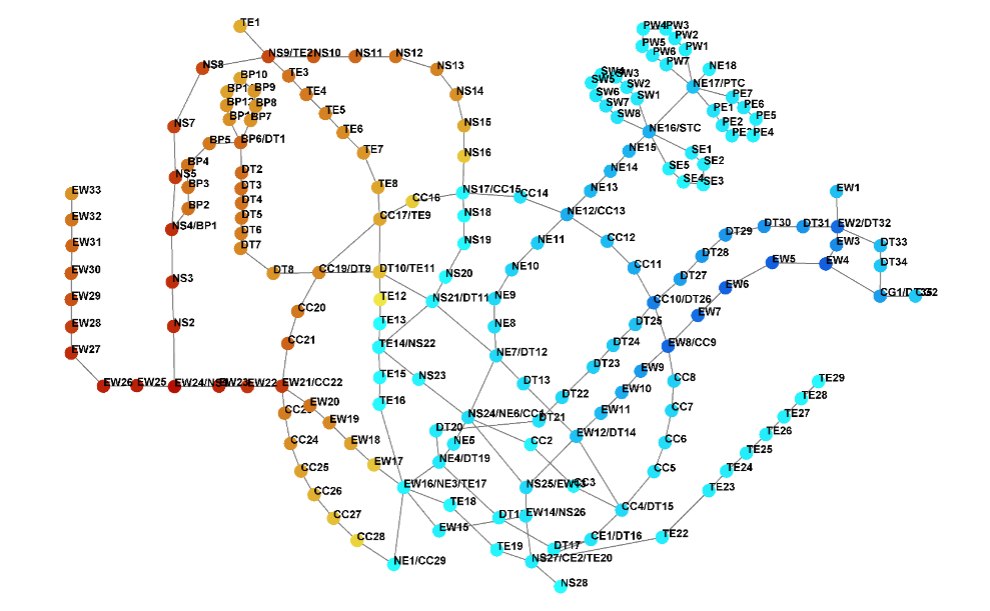 | 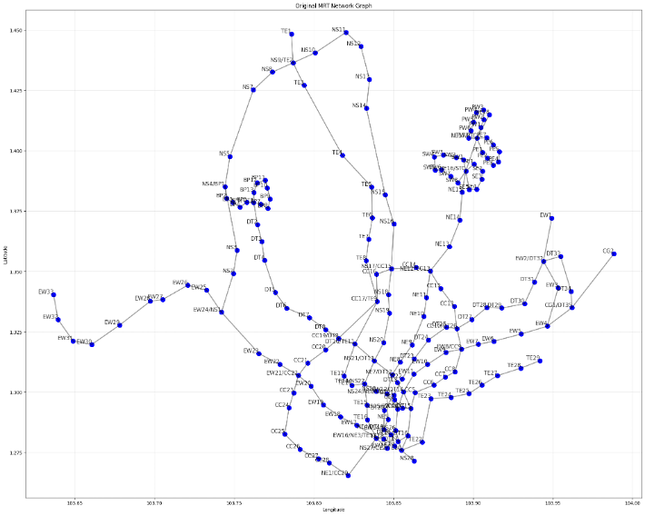 |
|---|---|
| *Fig 1.1 — MRT network modelled as a graph (nodes = stations, colour = line clusters)* | *Fig 1.2 — Same network plotted using real station coordinates (longitude/latitude)* |

The table below summarizes each analytical tool used, **what it measures, and how to read its value** — this interpretation frame is used consistently throughout the Findings sections.

| Tool | What it measures | Direction of "better" |
|---|---|---|
| **Adjacency / weight matrix ($W$)** | Passenger volume directly between two stations | N/A — input data |
| **Normalized Laplacian ($L = I - D^{-1/2}WD^{-1/2}$)** | Structural encoding of the network, scaled so stations of very different traffic volume can be compared fairly | N/A — intermediate matrix |
| **Fiedler eigenvalue ($\lambda_2$)** | *Algebraic connectivity* — how well-connected and evenly distributed the network's passenger flow is | **Higher is better.** A higher $\lambda_2$ means the network is harder to fragment and less reliant on any single station |
| **$\lambda_2$ benchmark** | Expected $\lambda_2$ for a network of similar size/degree distribution, used as a fair comparison point | Network's $\lambda_2$ **above** benchmark = well-connected; **below** = structurally weak |
| **Eigenvector value ($\hat V_i$, normalized 0–1)** | A station's structural importance / criticality to overall connectivity | **Higher is worse** (more vulnerable) — 1 = most vulnerable, 0 = not vulnerable |
| **Change in eigenvector (during disruption)** | How much a station's importance shifts once a disruption occurs | Large negative change = station lost relevance because it was cut off from traffic |
| **Utilization factor ($P_i = d_i / (f_i \cdot c_i)$)** | Crowding at a station — passenger flow relative to service capacity | **Lower is better.** Values approaching or exceeding the system's practical service rate indicate severe crowding |
| **Change in utilization factor** | How much crowding increases after a disruption or decreases after an upgrade | **More positive = worse** (disruption); **more negative = better** (solution) |
| **Articulation points (Tarjan's algorithm)** | Stations whose removal splits the network into disconnected components | Presence = structural single point of failure; fewer is better |
| **Cumulative eigenvalue impact** | Total drop in $\lambda_2$ across repeated Monte Carlo trials involving a given station | **Higher = more consistently damaging** when disrupted |
| **Satisfaction Factor (SF)** | Average utilization factor across affected edges — a proxy for commuter experience | **Lower is better** — lower SF = less crowding, better experience |
| **Total Cost (TC)** | Combined capital (new edges) and operational (frequency × capacity) cost per hour | Constrained by LTA budget; not inherently "better" or "worse", but traded off against SF |

**Disruption simulation tools:**

- **Dijkstra's algorithm** reroutes passengers onto the next-shortest available path once an edge is removed, updating the weight matrix so downstream metrics reflect realistic post-disruption behaviour.
- **Monte Carlo simulation** runs large numbers of randomized disruption scenarios (k-station, probability-weighted by vulnerability, and line-based) to capture a realistic distribution of failure impacts rather than relying on a handful of hand-picked cases.
- **Time-based logistic regression** models how commuter demand at a station rises and falls over the course of a day (morning/evening peaks plus a baseline), letting the static graph model be evaluated dynamically across time.
- **Stochastic optimization + Pareto frontier** searches the space of feasible upgrade packages (new edges, frequency, capacity) subject to LTA budget and operational constraints, and identifies the set of solutions that cannot be improved on one objective (cost or satisfaction) without worsening the other.

  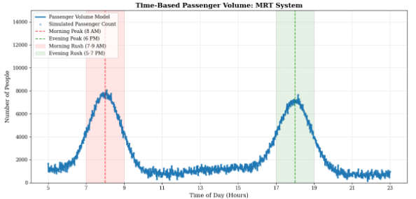
   <em>Fig 3.1 — Logistic regression fit of system-wide passenger volume over the day, showing the morning (~8am) and evening (~6pm) peaks the dynamic model captures.</em>

  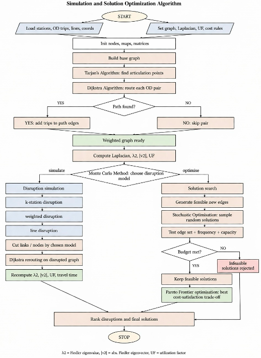
   <em>Fig 3.4 — End-to-end computational pipeline: graph construction → articulation points (Tarjan) → OD routing (Dijkstra) → connectivity metrics → disruption simulation (Monte Carlo) and solution search (stochastic optimization + Pareto frontier).</em>

Full derivations, worked numerical examples, and algorithm pseudocode are omitted here for brevity — this document reports methodology at a level sufficient to interpret the results.

---

## 3. Baseline Network Connectivity

| Metric | Value | Interpretation |
|---|---|---|
| Network $\lambda_2$ (Fiedler eigenvalue) | **0.0101929** | Actual algebraic connectivity of the Singapore MRT network |
| Benchmark $\lambda_2$ | **0.0416665** | Expected connectivity for a comparable network |
| Ratio | ~24% of benchmark | Network is roughly **400% worse connected** than expected |

**Significance:** Since $\lambda_2$ measures how evenly and robustly passenger flow is distributed, a value this far below benchmark indicates the network relies heavily on a small number of critical stations to hold the system together. A disruption at one of these stations is disproportionately damaging — consistent with the vulnerability analysis below.

As a mathematical check: the sum of all eigenvalues of the Laplacian equals its trace, which equals the number of stations (185). This was used to validate the eigenvalue computation.

---

## 4. Station Vulnerability Analysis

### 4.1 Highest Eigenvector Value per Line

Recall: **higher eigenvector value = more structurally vulnerable** (not necessarily more crowded).

| Line | Station | Normalized Eigenvector |
|---|---|---|
| NE | NE12/CC13 (Serangoon) | 0.0924 |
| TE | NS9/TE2 (Woodlands) | 0.1220 |
| DT | EW2/DT32 (Tampines) | 0.1541 |
| CC | EW8/CC9 (Paya Lebar / Buona Vista corridor) | 0.1586 |
| EW/NS | **EW24/NS1 (Jurong East)** | **0.2206** |

### 4.2 Overall Top 5 Most Vulnerable Stations

| Station | Normalized Eigenvector |
|---|---|
| EW24/NS1 (Jurong East) | 0.2205 |
| EW25 (Chinese Garden) | 0.1864 |
| EW26 (Lakeside) | 0.1859 |
| EW23 (Clementi) | 0.1774 |
| EW4 (Tanah Merah) | 0.1719 |

### 4.3 Station-by-Station Interpretation

- **EW24/NS1 (Jurong East)** — the single most vulnerable station and a major articulation point. It is the *only* connection between the western branch (Tuas Link, Pioneer, Chinese Garden, etc.) and the rest of the network. Disruption here would split the network in two, cutting off an estimated **6,497,323 daily commuters**.
- **EW8/CC9 (Buona Vista corridor)** — a nexus between the Circle Line and East-West Line (15.9% centrality). Disruption isolates western sectors (Clementi, Kent Ridge) from the Circle Line and pushes congestion onto Commonwealth station.
- **EW2/DT32 (Tampines)** — an interchange in a high-traffic business/commuter corridor connecting the Downtown and East-West lines. Not a hard articulation point (alternate paths exist via Raffles Place), but its passenger volume makes disruption here costly in crowding terms.
- **NS9/TE2 (Woodlands)** — the primary northern interchange (12.2% centrality) and the sole connector for Woodlands North (TE1) to the rest of the network; disruption cuts off an estimated **3,448,061 daily commuters**.
- **NE12/CC13 (Serangoon)** — comparatively low eigenvector value but the **highest daily commuter flow** of the five (8,173,738 passengers/day). Illustrates that a high-traffic station is not automatically structurally critical — Serangoon's disruption raises crowding sharply but does not fragment the network.

**Trend:** Vulnerability clusters heavily along the **East-West Line**, concentrated around Jurong East — stations on the western branch are structurally dependent on it as their sole gateway to the rest of the network. This is a recurring theme across every subsequent simulation.

  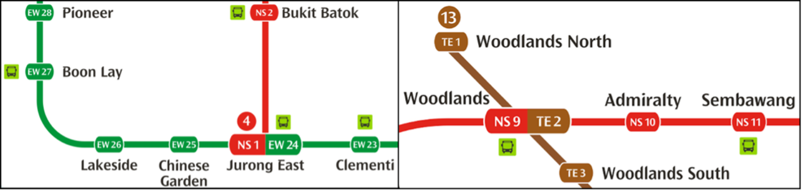
   <em>Fig 3.2 — Articulation points on the network map. Left: Jurong East (EW24/NS1) as the sole bridge between the western branch and the rest of the network. Right: Woodlands (NS9/TE2) as the sole connector for Woodlands North (TE1).</em>

---

## 5. Disruption Simulation Results

### 5.1 Targeted Disruption of the 5 Most Vulnerable Stations

| Station Disrupted | Pre-Disruption $\lambda_2$ | Post-Disruption $\lambda_2$ | Avg. Δ Eigenvector | Avg. Δ Utilization Factor |
|---|---|---|---|---|
| NE12/CC13 (Serangoon) | 0.010193 | 0.008802 | −0.005178 | +482.94 |
| NS9/TE2 (Woodlands) | 0.010193 | 0.009706 | −0.003078 | +462.37 |
| EW2/DT32 (Tampines) | 0.010193 | 0.010913 | +0.000881 | +166.43 |
| EW8/CC9 (Paya Lebar) | 0.010193 | 0.007691 | −0.008240 | +876.97 |
| EW24/NS1 (Jurong East) | 0.010193 | 0.011035 | −0.003809 | +366.02 |
| **All 5 stations simultaneously** | **0.010193** | **0.007088** | **−0.013255** | **+1199.74** |

**Reading the table:** A falling $\lambda_2$ means the network is losing connectivity (worse); a rising utilization factor means crowding is increasing (worse). EW8/CC9 (Paya Lebar) is the single worst individual disruption on both counts. The simultaneous 5-station failure is materially worse than any individual case — connectivity drops furthest and crowding rises furthest, confirming that these five stations' vulnerabilities are not redundant but compounding.

Interestingly, EW2/DT32 and EW24/NS1 show **eigenvalue increases** when disrupted individually. This is a known artefact of Fiedler-value behaviour: removing a poorly-integrated node can sometimes marginally raise the connectivity of the *remaining* graph, even though the removed station's own communities become cut off. This is why eigenvector change and utilization factor are tracked alongside $\lambda_2$, rather than relying on $\lambda_2$ alone.

---

## 6. Monte Carlo Random Disruption Analysis

100,000 disruption scenarios were simulated, each randomly disrupting 1–5 edges, with disruption probability weighted by each station's eigenvector value (i.e. more vulnerable stations were disrupted more often, mirroring realistic risk).

- **Baseline $\lambda_2$:** 0.0101929
- **Average $\lambda_2$ across all 100,000 trials:** 0.0092724 (a persistent ~9% average drop in connectivity)

### 6.1 Top 5 Stations by Cumulative Eigenvalue Impact

*(Higher = more consistently damaging to network-wide connectivity when disrupted, summed across all trials it appeared in)*

| Rank | Station | Cumulative Eigenvalue Impact |
|---|---|---|
| 1 | EW23 (Clementi) | 15.05 |
| 2 | EW22 (Dover) | 13.16 |
| 3 | EW21/CC22 (Buona Vista) | 8.88 |
| 4 | EW24/NS1 (Jurong East) | 8.20 |
| 5 | EW6 (Kembangan) | 6.74 |

All top stations except Kembangan cluster on the western EW corridor near Jurong East, reinforcing that this region is the network's single largest structural liability.

### 6.2 Top 5 Stations by Rise in Utilization Factor When Disrupted

*(Higher Δ = worse crowding spike)*

| Rank | Station | Δ Utilization |
|---|---|---|
| 1 | CC17/TE9 (Caldecott) | +851.82 |
| 2 | TE3 (Woodlands South) | +848.57 |
| 3 | TE4 (Springleaf) | +844.48 |
| 4 | TE5 (Lentor) | +843.59 |
| 5 | TE6 (Mayflower) | +839.00 |

These stations sit along the Thomson-East Coast corridor near Woodlands, where alternative routing is limited — disruption forces demand onto a small number of remaining paths, producing severe localized crowding even though the *network-wide* connectivity loss is smaller than in the EW-line cases above.

### 6.3 Top 5 Stations by Self-Disruption Eigenvector Change

*(More negative = greater loss of structural importance once removed — expected for stations whose relevance depends entirely on their neighbours)*

| Rank | Station | Δ \|Eigenvector\| |
|---|---|---|
| 1 | EW26 (Lakeside) | −0.04504 |
| 2 | EW27 (Boon Lay) | −0.04500 |
| 3 | EW28 (Pioneer) | −0.04095 |
| 4 | EW25 (Chinese Garden) | −0.04047 |
| 5 | EW29 (Joo Koon) | −0.03566 |

All five sit on the western branch beyond Jurong East — direct confirmation that this branch's structural importance is *entirely* mediated through the Jurong East interchange.

---

## 7. Line-Level Disruption Analysis

Each MRT line was disrupted in full to test system-wide resilience to large-scale, corridor-level failures (e.g. signalling faults affecting an entire line).

| Line Disrupted | Pre-Disruption $\lambda_2$ | Post-Disruption $\lambda_2$ | Avg. Δ Eigenvector | Avg. Δ Utilization Factor |
|---|---|---|---|---|
| NE (North-East) | 0.010193 | 0.016979 | −0.017414 | **+4.03** |
| NS (North-South) | 0.010193 | 0.006031 | −0.005470 | **+1652.16** |
| EW (East-West) | 0.010193 | 0.011683 | −0.002943 | +722.43 |
| CC (Circle) | 0.010193 | 0.013463 | −0.026538 | +126.65 |
| **DT (Downtown)** | 0.010193 | **0.005235** | −0.007327 | **+3762.04** |
| TE (Thomson-East Coast) | 0.010193 | 0.014616 | −0.012994 | +169.68 |

**Interpretation:** The **Downtown Line** and **North-South Line** cause the most severe network-wide consequences — both a sharp connectivity drop *and* the largest crowding spikes (+3762 and +1652 respectively), because commuters are funnelled onto a small number of remaining lines. By contrast, the **North-East Line** shows connectivity *improving* post-disruption and almost no crowding impact (+4.03) — demand is small enough and well-enough distributed across alternatives that its removal barely stresses the rest of the network.

---

## 8. Cost & Satisfaction Optimization

To move from diagnosis to a feasible proposal, the report defines two co-dependent objectives and searches for the best trade-off between them via a Pareto frontier.

- **Total Cost (TC)** — capital cost of new edges plus operational cost of frequency and capacity, in cost per hour. Constrained (not "good" or "bad" in isolation) by the LTA's actual FY2024/2025 budget figures.
- **Satisfaction Factor (SF)** — average utilization factor across affected edges. **Lower SF = higher commuter satisfaction.**

**Key operational constraints** (drawn from LTA budget disclosures and rolling-stock specifications): capital budget ≤ S$1,487,559,500; operational budget ≤ ~S$301,440,500/year; train frequency between 1–50/hour; service rate must exceed arrival rate; train capacity fixed at manufacturer specification (310–320 pax/cabin); new edge length ≤ 1.05 km (network median).

100,000+ candidate solutions (edge combinations × frequency × capacity) were generated via stochastic optimization and evaluated on the TC–SF plane; the Pareto-optimal frontier was extracted (N=2,417 valid solutions).

| | Capacity | Frequency | Total Flow | Total Cost | Satisfaction Factor |
|---|---|---|---|---|---|
| **Current network** | 310–320 pax/train | 12 trains/hr (~5 min headway) | 11,160–23,040 pax/hr | −S$690,704/hr* | **0.1964** |
| **Optimal solution (2 new edges)** | 930 pax/train | 15.52 trains/hr (~3.9 min headway) | 14,438 pax/hr | S$0.0207 (normalized) | **0.0067** |

*The current network's negative TC reflects that it operates below the modelled reference cost baseline used for comparison — it is not itself over budget.*

**Significance:** SF drops from 0.1964 to 0.0067 — roughly a **30x improvement** in modelled commuter satisfaction — while remaining within all budget constraints. The Pareto frontier shows most feasible solutions cluster near the axes (a curve resembling $y = \log_{0.5}(x)$), and the chosen operating point sits close to the origin — simultaneously low-cost and low-dissatisfaction relative to the rest of the feasible set.

| 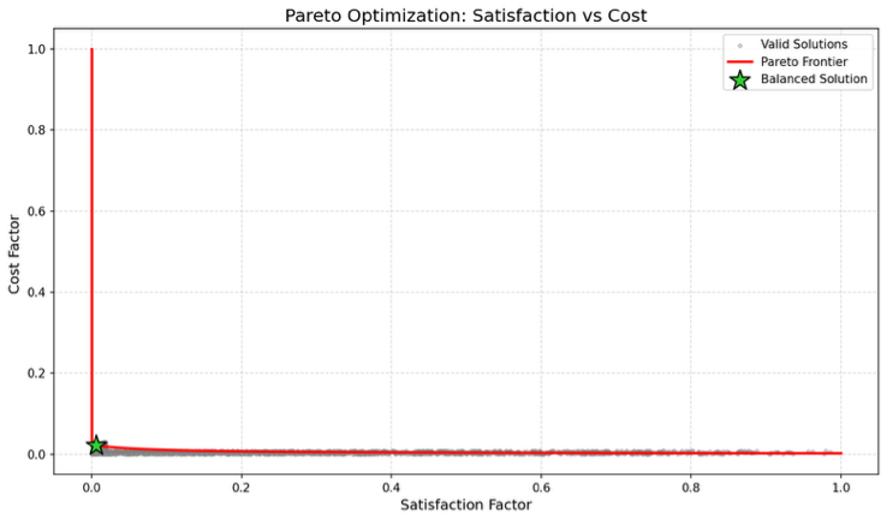 | 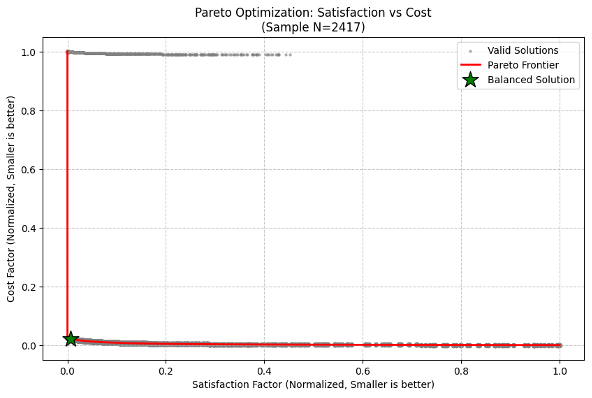 |
|---|---|
| *Fig 3.5 — Illustrative Pareto frontier: valid solutions (grey), the frontier (red), and the balanced optimum (star)* | *Fig 3.55 — Actual Pareto frontier for the MRT network (N=2,417 feasible solutions), normalized axes, smaller is better on both* |

---

## 9. Proposed Solution

### 9.1 Recommended New Edges

| Rank (by composite score) | Edge | Stations Connected | Δ Eigenvalue | Δ Utilization Factor |
|---|---|---|---|---|
| 1 | TE12–TE14/NS22 | Napier ↔ Orchard | +0.000428 | −146.67 |
| 2 | NE15–SE5 | Buangkok ↔ Ranggung | +0.000104 | −131.65 |
| 3 | EW11–NE7/DT12 | — | +0.005346 | −261.45 |
| 4 | NE12/CC13–NS17/CC15 | — | +0.004297 | −198.77 |
| 5 | CC17/TE9–NS18 | — | +0.000635 | −88.49 |

The two top-ranked edges by composite score (balancing connectivity gain, vulnerability reduction, and crowding relief) were selected as the final proposal:

1. **TE12–TE14/NS22 (Napier–Orchard)** — creates a new cross-link between the Thomson-East Coast and North-South lines, providing an alternate path that slightly raises both $\lambda_2$ and station-level importance while reducing utilization.
2. **NE15–SE5 (Buangkok–Ranggung)** — addresses a separate structural weak point: Sengkang is currently the *sole* connector between the Sengkang (SE) LRT line and the main MRT network, making it both an articulation point and a high-eigenvector station. This edge removes that single point of failure.

**Estimated capital cost: S$1.04 billion**, derived from historical per-station construction costs (Sungei Bedok, Aviation Park, Loyang, Jurong Lake District, Maju, Elias, Hougang).

**Operational package:** increase train capacity to 930 pax/train and frequency to ~15.52 trains/hour (~3.9 min headway).

**Note on scope:** the proposal deliberately excludes new *stations/nodes*, since the project's objective is improving connectivity within the existing network rather than geographic expansion. Adding edges between existing stations achieves this more cost-effectively than adding nodes.

| 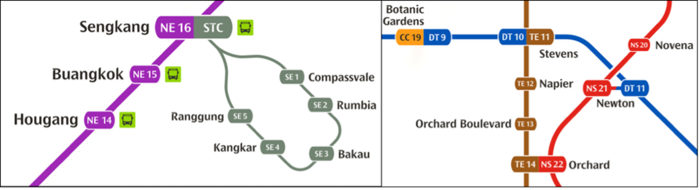 | 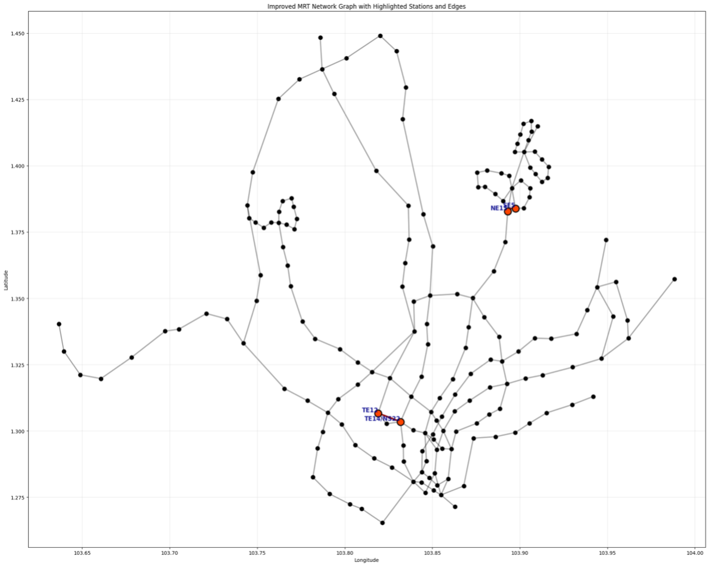 |
|---|---|
| *Fig 3.6 — Local context of the two proposed edges: Buangkok–Ranggung (left) and Napier–Orchard (right)* | *Fig 3.6 — The two new edges (orange, labelled) plotted on the full network map with real coordinates* |

---

## 10. Post-Solution Results

### 10.1 Five-Station Disruption, Before vs. After

| | Pre-Disruption $\lambda_2$ | Post-Disruption $\lambda_2$ | Avg. Utilization Change |
|---|---|---|---|
| **Before solution** | 0.010193 | 0.007088 | +1199.74 |
| **After solution** | 0.010057 | 0.009538 | +462.44 |
| **Net effect** | — | **+35% connectivity retained** | **−61.5% crowding** |

This is the headline result: under the worst-case simultaneous failure of all five critical stations, the proposed upgrades leave the network **35% better connected** and **61.5% less crowded** than it would otherwise be.

### 10.2 Individual Station Disruption, Before vs. After

| Station | Δ Utilization (Before) | Δ Utilization (After) | Change | Post-$\lambda_2$ (Before) | Post-$\lambda_2$ (After) |
|---|---|---|---|---|---|
| NE12/CC13 (Serangoon) | +482.94 | +391.66 | **−91.28 (better)** | 0.00880 | 0.00877 (≈ unchanged) |
| NS9/TE2 (Woodlands) | +462.37 | +462.44 | ≈ no change | 0.00971 | 0.00697 (**worse**) |
| EW2/DT32 (Tampines) | +166.43 | +1133.35 | **+966.92 (worse)** | 0.01091 | 0.01075 (≈ unchanged) |
| EW8/CC9 (Buona Vista) | +876.97 | +854.37 | −22.60 (slightly better) | 0.00769 | 0.00761 (≈ unchanged) |
| EW24/NS1 (Jurong East) | +366.02 | +359.30 | −6.72 (marginally better) | 0.01104 | 0.01089 (≈ unchanged) |

**Interpretation of anomalies:**
- **Serangoon** benefits clearly from the new edges — a larger share of its rerouted passengers now has higher-capacity alternative paths, though its own structural importance is unchanged.
- **Woodlands** sees no crowding improvement and a *worse* post-disruption connectivity figure — the new edges appear to route additional traffic toward Woodlands, which combined with higher frequency keeps its crowding level flat rather than reducing it.
- **Jurong East** sees only marginal improvement on both metrics. Since it remains the sole bridge to the western branch, and neither new edge touches that branch directly, its criticality is structurally unchanged by this particular proposal.
- **Tampines** is the clear outlier: crowding **worsens significantly** post-solution (+966.92), flagging it as a priority for a *future, separate* intervention in the eastern part of the network — the current proposal does not address it.

### 10.3 Visual Summary: Before vs. After, by Metric

| 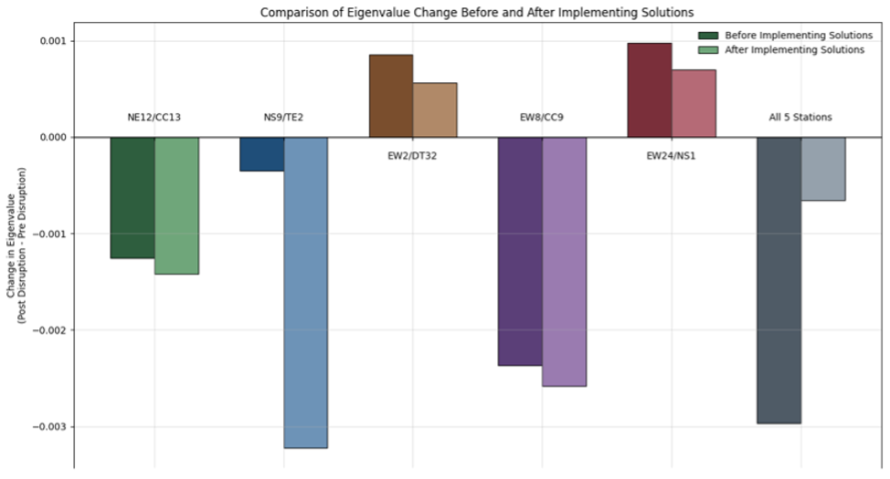 | 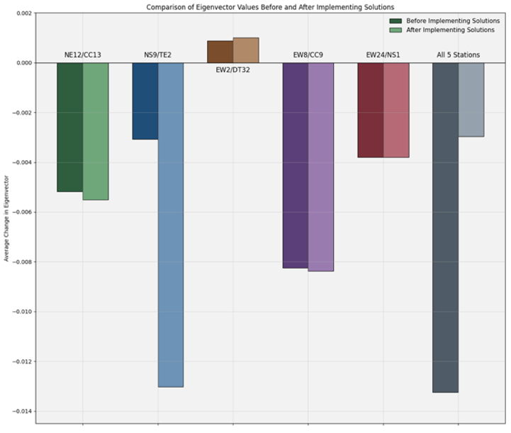 |
|---|---|
| *Fig 4.1 — Change in post-disruption $\lambda_2$ per scenario, before vs. after solutions (higher/less negative is better)* | *Fig 4.2 — Change in post-disruption eigenvector value per scenario, before vs. after solutions* |

  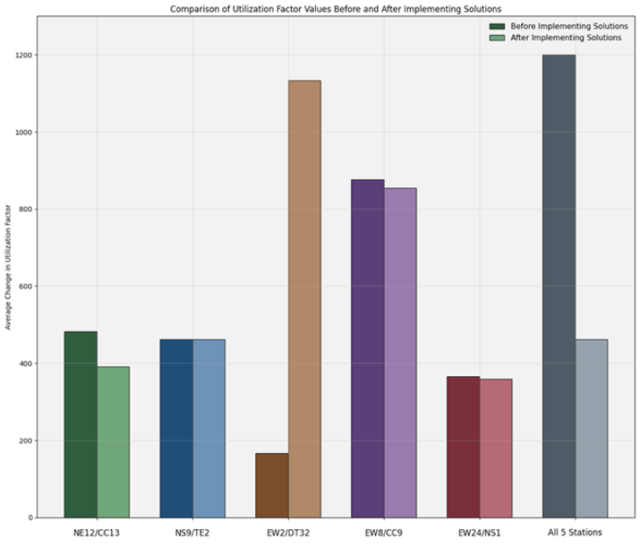
   <em>Fig 4.3 — Change in post-disruption utilization factor per scenario, before vs. after solutions (lower is better). The Tampines (EW2/DT32) spike is the visible exception to the network-wide improvement.</em>

---

## 11. Commuter Flow Modelling

Using the time-based logistic regression model, predicted daily commuter flow at the five critical stations was compared before and after the proposed changes.

| Station | Commuter Flow (Before) | Commuter Flow (After) | Change | % Change |
|---|---|---|---|---|
| NE12/CC13 (Serangoon) | 14,205,781 | 14,202,335 | −3,446 | −0.024% |
| NS9/TE2 (Woodlands) | 7,654,376 | 7,684,976 | +30,600 | **+0.400%** |
| EW2/DT32 (Tampines) | 5,335,759 | 5,335,759 | 0 | 0.000% |
| EW8/CC9 (Paya Lebar) | 9,987,072 | 9,987,072 | 0 | 0.000% |
| EW24/NS1 (Jurong East) | 12,359,127 | 12,333,374 | −25,753 | −0.208% |

**Interpretation:** Overall daily demand is essentially unchanged network-wide — the solution redistributes flow rather than reducing it. Passengers shift *away* from the most crowded stations (Serangoon, Jurong East) *toward* the relatively less-crowded Woodlands, consistent with the new edges providing viable alternate routing. Tampines and Paya Lebar are geographically distant from the new edges and see no redistribution effect at all, which is consistent with their crowding *not* improving in Section 10.2.

Both before and after graphs retain a consistent **bimodal daily pattern** (morning peak ~6–9h, evening peak ~16–19h), confirming that Singapore's MRT crowding problem is driven primarily by peak-hour concentration rather than total daily volume — an important caveat for future work, since the current proposal addresses structural/spatial crowding but not time-of-day concentration directly.

| 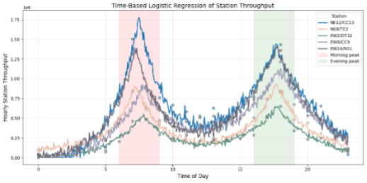 | 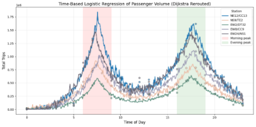 |
|---|---|
| *Fig 3.7 — Predicted hourly throughput at the 5 critical stations, before implementing solutions* | *Fig 3.75 — Predicted hourly throughput after adding the two new edges and rerouting via Dijkstra* |

  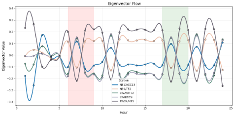
   <em>Fig 3.8 — Eigenvector value of each critical station over the course of a day. Values surge during morning/evening peaks (shaded), showing that structural importance, not just traffic, spikes at rush hour.</em>

---

## 12. Key Findings & Conclusion

1. **The network is structurally under-connected.** Baseline $\lambda_2$ (0.01019) is roughly 400% below the expected benchmark (0.04167), indicating heavy reliance on a small number of critical stations.
2. **Vulnerability is concentrated, not distributed.** The East-West Line — particularly around **Jurong East** — accounts for the majority of high-impact vulnerabilities across every simulation method used (targeted, Monte Carlo, and self-disruption analysis).
3. **Vulnerability ≠ crowding.** High-traffic stations (e.g. Serangoon) are not necessarily structurally critical, and structurally critical stations (e.g. Jurong East) are not necessarily the most crowded. Interventions must be targeted accordingly.
4. **Large-scale line disruptions are most damaging on the Downtown and North-South Lines**, both in connectivity loss and crowding spikes, while the North-East Line is comparatively low-risk.
5. **The proposed solution — two new edges (S$1.04B) plus a capacity/frequency increase — is validated by simulation**: it improves worst-case (5-station) post-disruption connectivity by 35% and reduces crowding by 61.5%, and is selected via an unbiased Pareto-optimal search across 2,417 feasible candidate solutions, improving the modelled satisfaction factor by ~30x while remaining within LTA budget constraints.
6. **The proposal is not a complete fix.** It leaves Jurong East's core vulnerability largely unchanged and *worsens* crowding at Tampines, indicating clear priorities for a follow-up phase of interventions.

Singapore's MRT network is not just infrastructure — it is a daily lifeline for millions. This project demonstrates that its structural weaknesses can be precisely located and its resilience meaningfully improved through mathematically grounded, budget-constrained interventions, rather than intuition alone.

---

## 13. References

- Fiedler, M. *Algebraic connectivity of graphs*. Czechoslovak Mathematical Journal.
- Borgatti, S. P. *Centrality and Network Flow*.
- Zhu, C. & Roy, S. (2023). *Graph-Theoretic Analyses and Model Reduction for an Open Jackson Queueing Network*. American Control Conference (ACC).
- Land Transport Authority (LTA) DataMall — Dynamic Datasets.
- LTA Annual Financial Statement, FY2024/2025.
- SimplyGo eGuide — MRT/LRT Journey Information.
- MRT.SG — Map of Singapore MRT and LRT Lines.
- Contract/cost disclosures: Aviation Park, Loyang, Maju, Jurong Lake District, Elias, and Hougang MRT station construction (The Business Times, Railway Technology, The Straits Times, LTA newsroom).
- Wikipedia — *Alstom Metropolis C830* (rolling stock specifications).
- xkjyeah — *MRT-and-LRT-Stations* dataset, GitHub.
