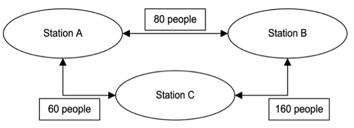
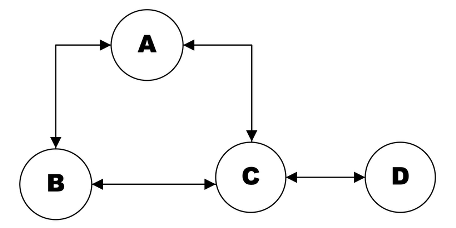
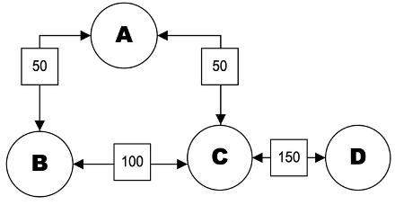

# StationFlow: A Mathematical Approach for MRT Disruption and Crowd Management

**By: Qu Guanyu, Zhang Hanyu**

## Table of Contents

- [I. Summary](#i-summary)
- [1. Overview and Introduction of Project](#chapter-1-overview-and-introduction-of-project)
  - [1.1 Introduction](#11-introduction)
  - [1.2 Objectives of the Project](#12-objective-of-the-project)
  - [1.3 Definition and Setting Boundaries of Research](#13-definition-and-setting-boundaries-of-research)
  - [1.4 Abstract](#14-abstract)
- [2. Methodology and Theory](#chapter-2-methodology-and-theory)
  - [2.1 Graph Modeling](#21-graph-modeling)
  - [2.2 Normalized Laplacian Matrix](#22-normalized-laplacian-matrix)
  - [2.3 Eigenvalues and Eigenvectors](#23-eigenvalues-and-eigenvectors)
  - [2.4 Queuing Theory](#24-queuing-theory)
- [3. Applications and Proposal](#chapter-3-applications-and-proposal)
  - [3.1 Extending the Model to the MRT System](#31-extending-the-model-to-the-mrt-system)
  - [3.2 Extending the Model Using Time-Based Logistic Regression](#32-extending-the-model-using-time-based-logistic-regression)
  - [3.3 Interpretation of Results](#33-interpretation-of-results)
  - [3.4 Explanation of the Method of Simulation](#34-explanation-of-the-method-of-simulation)
  - [3.5 Assessment of Disruption in Vulnerable Stations](#35-assessment-of-disruption-in-vulnerable-stations)
  - [3.6 Operational Solutions for Network Disruptions](#36-operational-solutions-for-network-disruptions)
  - [3.7 Optimization of Consumer Satisfaction and Cost](#37-optimization-of-consumer-satisfaction-and-cost)
  - [3.8 Graph of Final Product](#38-graph-of-final-product)
  - [3.9 Proposal](#39-proposal)
- [4. Extension of Model and Conclusion](#chapter-4-extension-of-model-and-conclusion)
  - [4.1 Key Findings](#41-key-findings)
  - [4.2 Extensions](#42-extensions)
  - [4.3 Conclusion](#43-conclusion)
- [5. Appendix: Results, Code, Data, References](#chapter-5-appendix-code-data-references)
  - [5.1 References](#51-references)

---

## I: Summary

### Project Introduction

Every day, millions of passengers across Singapore rely on the MRT network for their commutes. Yet behind this facade lies a hidden vulnerability: when just one station is disrupted, delays spread rapidly, crowding worsens, and the effects can ripple far beyond the original disruption. Despite the scale of these disruptions, many existing analyses of the MRT network remain limited and focused solely on one factor, e.g., crowding. This project, therefore, investigates the Singapore MRT network through mathematics, uncovering its vulnerabilities and evaluating how disruptions can affect the system as a whole, before proposing mathematically proven optimal solutions.

### Project Overview

The Stationflow report investigates how mathematical modelling can be used to study vulnerability (measured by eigenvectors), crowding (measured by utilization factor), and connectivity (measured by eigenvalues) in Singapore's MRT network. The project identifies stations that are not only crowded but also structurally important to the whole system, so that the effect of disruption can be measured. The main purpose of the project is to evaluate both everyday operating conditions and severe disruption scenarios, then propose mathematically sound solutions to improve resilience, reduce crowding, and improve connectivity. The report also distinguishes between a crowded station and a vulnerable station: a station may carry many passengers yet remain relatively resilient if it has multiple alternative connections, whereas a vulnerable station is one whose disruption causes a large drop in overall algebraic connectivity.

### Methodology

The MRT network is first represented as a weighted graph, where stations are nodes and direct connections between stations are weighted edges (represented by passenger volume). Afterwards, the report constructs a normalized Laplacian matrix to study network structure. From this matrix, the key metric is the Fiedler eigenvalue, which measures algebraic connectivity: a higher value indicates that passenger flow is more evenly distributed and that the network is well connected. Eigenvectors are used to identify stations which structural role makes them especially critical. To study congestion, the report also applied queuing theory, particularly the utilization factor, which connects passenger flow with train frequency and the network's carrying capacity. The static network model is then extended using time-based logistic regression to simulate commuter demand throughout the day.

### Application of Theory

The theoretical framework is then applied through simulations to test how the MRT network behaves under both normal and disrupted conditions. The model simulates disruptions by removing edges to selected stations and recalculating the corresponding eigenvalues, eigenvectors, and utilization factors. This shows how strongly each disruption weakens connectivity and crowding. The report also simulates proposed improvements, such as increasing train frequency and adding new edges between selected stations, and compares the resulting metrics with those of the original network. To decide which improvements are most effective, the Pareto frontier is used. This is necessary as transport planning involves multiple competing objectives: a solution may improve connectivity greatly but require more construction, while another may reduce congestion more directly with less structural benefit. The Pareto frontier focuses on reducing two interdependent variables, SF (crowding) and TC (cost), and identifies the chosen solutions that strike the best possible balance in strengthening network resilience, reducing crowding, and costs.

### Baseline Findings

The findings show that the MRT network is structurally weaker than the benchmark. The Fiedler eigenvalue is approximately 0.01019, far below the benchmark value of about 0.04167, which indicates low algebraic connectivity. Hence, the MRT network is poorly connected. The eigenvector analysis identifies EW24/NS1 (Jurong East) as the most vulnerable station, followed by other interchanges, including EW8/CC9 (Paya Lebar), EW2/DT32 (Tampines), NS9/TE2 (Woodlands), and NE12/CC13 (Serangoon). A major pattern in the results is that many of the most sensitive stations cluster around the East-West Line, showing that this part of the network depends heavily on a few critical nodes. Lastly, the eigenvector values also show that vulnerability in the MRT network is not evenly distributed but is concentrated around major articulation points. This further emphasizes the need for improvements.

### Simulation Findings

The crux of the report lies in its simulation and the results obtained here. Using 3 methods of disruption, rerouting through Dijkstra's algorithm, and large-scale random testing through Monte Carlo methods, our study measures changes in eigenvalue, eigenvector, travel behavior, and utilization factor after failures. The results show that when vulnerable stations are disrupted, connectivity falls and crowding rises sharply at the remaining operational stations. In the five-station disruption scenario before solutions are introduced, the post-disruption eigenvalue falls to about 0.00709, while the average utilization factor rises to about 1199.74, indicating severe crowd concentration. Individual station results also reveal important insights. For instance, Buona Vista causes especially large crowd redistribution, while Jurong East remains structurally critical because the surrounding western stations depend on it to access the rest of the network.

| Station Disrupted | Pre Disruption Eigenvalue | Post Disruption Eigenvalue | Average Change in Eigenvector | Average Change in Utilization Factor |
|---|---|---|---|---|
| All 5 critical Stations* | 0.0101928971870971 | 0.00708759399321063 | -0.0132547507593228 | 1199.73501028807 |

\* NE12/CC13, NS9/TE2, EW2/DT32, EW8/CC9, EW24/NS1

### Solution Finding

To justify the proposal economically, the Pareto Frontier is used to balance total cost against commuter satisfaction. Rather than recommending the most expensive upgrade, the report proposes solutions that are feasible under budget and operational constraints. The selected operating point yields a satisfaction factor* (SF) of 0.0067, compared with 0.1964 for the current network, indicating a significant 300% improvement in the commuter experience.

*Lower SF represents greater commuter satisfaction

| EDGE_BETWEEN_STN | STN_A | STN_B | current_eigen_value | avg_change_eigen_vector | avg_change_util_factor | composite_score |
|---|---|---|---|---|---|---|
| TE12 - TE14/NS22 | TE12 | TE14/NS22 | 0.010053 | 0.000428 | -146.669444 | 0.721966 |
| NE15 - SE5 | NE15 | SE5 | 0.010022 | 0.000104 | -131.647778 | 0.700461 |

### Proposed Solutions

The proposed solutions combine structural and operational changes. Structurally, the report recommends constructing two new cross-links, TE12 - TE14/NS22 (Napier-Orchard) and NE15-SE5 (Buangkok - Ranggung), at an estimated capital cost of S$1.04 billion. Operationally, it recommends raising service capacity to 930 passengers per train and increasing frequency to about 15.52 trains per hour. These changes improve resilience most clearly under worst-case stress. In the five-station disruption scenario, the post-disruption eigenvalue improves from about 0.00709 before intervention to about 0.00954 after intervention, meaning the disrupted network is about 35% better connected. At the same time, the average utilization factor drops from about 1199.74 to 462.44, a crowding reduction of approximately 61.5%. What this shows is that rerouted passenger flow is spread more evenly and that extreme crowding is significantly reduced. This means the trend is clear: adding edges creates more shortest-path alternatives, while increasing frequency raises service rates and lowers congestion on heavily used routes.

| Edges Built | Capacity | Frequency | Total Flow | Total Cost | Satisfaction Factor |
|---|---|---|---|---|---|
| 2 edge | 310 pax/train cabin* | 15.52 trains/hour (approx 3.9 min headway) | 14438 pax/hour | 0.0207 | 0.0067* |

*960 passengers per train

### Conclusion

Overall, the report concludes that Singapore's MRT network is vulnerable due to poor algebraic connectivity and overdependence on several critical nodes. However, our report shows that targeted edge-building, together with capacity and frequency adjustments, can significantly strengthen resilience and reduce crowding. Ultimately, this report shows not only where the network is most at risk, but also how targeted improvements can strengthen resilience and reduce disruption impacts. StationFlow demonstrates that mathematics is not just a tool for analysis, but an immensely influential pathway to shape the future for millions of people living in Singapore and all around the world.

---

## Chapter 1: Overview and Introduction of Project

### 1.1 Introduction

The Singapore MRT network is one of the most essential components of Singaporeans' daily lives, carrying a large volume of commuters every day across different regions. However, when disruptions occur, their effects are often far-reaching, leading to severe delays and widespread crowding across connected stations and interchange hubs. Due to the network's highly interconnected nature, the failure of a single critical station can trigger ripple effects that weaken the network's overall connectivity. Despite the sheer impact of this problem, many existing analyses of the MRT network remain limited. Hence, in this project, we will apply mathematical evaluations to the Singapore MRT network, using linear algebra and complex simulations to model real-life MRT disruption patterns. Based on the simulation results, we will then mathematically search for feasible solutions that improve MRT network connectivity and reduce crowding throughout the network.

### 1.2 Objective of the Project

Overall, the core objectives of StationFlow are to create a better-connected, less vulnerable MRT network, where the commuter flow is not concentrated, but well distributed and spread across the MRT network. This involves reducing the network's overreliance on a single station, thereby reducing the severity of disruptions. By improving how passengers are spread throughout the network, crowding at major interchanges can be alleviated. In addition, a more balanced distribution of commuters enhances the system's resilience. Ultimately, the goal is to create a network that operates more efficiently daily and remains robust under disruptions.

- Identify vulnerable stations and articulation points
- Evaluate the connectivity of the MRT network
- Investigate the effects of disruption on the MRT network
- Propose optimal solutions to improve network connectivity
- Reduce station vulnerability and crowding

### 1.3 Definition and Setting Boundaries of Research

*Important notes*:
- In this report, 'vulnerable stations' refer to stations with high eigenvector values and are the most critical to the MRT network
- A vulnerable station is defined as a station with high importance and a high eigenvector value
- 'Crowded station' ≠ 'vulnerable stations'
- Any use of (V, E) in the following report represents a set of nodes, with a connection between them
- An Articulation Point is defined as a node whose removal disconnects the network, and by splitting it into two, it increases the number of components of the network

### 1.4 Abstract

This project mainly consists of 2 major segments: theory and, most importantly, simulation and expansion of the math model.

**Theory**

Firstly, we use linear algebra and graph theory to construct a Normalized Laplacian matrix, for a structured analysis of the MRT network's connectivity. Subsequently, we apply spectral graph theory, specifically through the computation of eigenvalues and eigenvectors of the Laplacian matrix. The second-smallest eigenvalue is computed and evaluates the network's algebraic connectivity, while the corresponding eigenvectors are utilized to identify the most vulnerable stations within the MRT network.

**Expansion of the Theory and Simulation**

The second segment is the crux of the paper and utilizes a simulation of disruption. It consists of the implementation of a Monte Carlo model, combined with Dijkstra's algorithm for passenger rerouting. Disruptions are systematically introduced by modifying the network's weights, allowing us to analyse their impact on connectivity and crowding. Following this, stochastic and Pareto Frontier optimisation is applied to search for possible solutions and determine the optimal trade-off between operational cost and commuter satisfaction, giving us the optimal solution.

---

## Chapter 2: Methodology and Theory

In the first step of this project, the data collected from the Singapore MRT network is represented as a graph to simplify and allow the graph to be easily analyzed. Each MRT station is modeled as a node (𝑛), and each direct connection between stations is represented by an edge (𝑒).

### 2.1 Graph Modeling

*Fig. 1.1 illustrates the MRT network*

*Fig. 1.2 illustrates the MRT network based on actual coordinates (longitude and latitude)*

**Formula:**

$$G = (V, E)$$

Where:

$$e_{ij} \in E$$
$$i = 1, 2, 3, \dots, n$$

- $N = \{n_1, n_2, n_3, \dots, n_n\}$: the set of nodes, with each $n_i$ representing a station.
- $E = \{e_{ij}\}$, a set of edges, $e_{ij}$ represents a direct connection between stations $n_i$ and $n_j$

**Weighted Edges: Modelling Passenger Volume**

Each edge has a weight (𝑊) that represents the passenger volume between the two stations. For example, $w_{ij}$ represents the volume of passengers traveling between station $n_i$ and station $n_j$. Suppose there is no direct connection, $w_{ij} = 0$. This transforms our graph into a weighted graph. Similarly, in computer science, $(V,E)$ in our model represents a set of nodes; $V$ represents a parent node, while $E$ represents a node connected to it. Unlike unweighted models, which are commonly used, the weighted models employed in this project provide a more informative and in-depth analysis of MRT crowding and connections. By modeling the MRT system as a weighted graph, we can use matrix operations to quantify passenger flows among stations.

### 2.2 Normalized Laplacian Matrix

To analyze the structure and flow within the Singapore MRT network effectively, we use a tool called the Normalized Laplacian matrix. This matrix not only provides information about the connections but also the volume of passengers traveling along these connections, giving us deeper insight into the network's behavior.

**Formula:**

$$L = I - D^{-\frac{1}{2}}WD^{-\frac{1}{2}}$$

$$L_{ij} = \begin{cases} 1, & \text{if } i = j \text{ and } d_i \neq 0 \\ -\dfrac{w_{ij}}{\sqrt{d_i \cdot d_j}}, & \text{if } i \neq j \text{ and } w_{ij} \neq 0 \\ 0, & \text{otherwise} \end{cases}$$

$$d_i = \sum_j w_{ij}$$

Where:
- $w_{ij}$ is the number of people traveling directly from node $i$ and $j$
- $D$ is a degree matrix (Diagonal sum of weights)
- $I$ is an identity matrix
- $W$ is an adjacency matrix
- $d_i$ is the total passenger flow at station $i$

**Explanation — Example:**

*Fig. 1.23 depicts a simplistic two-way network. This example will be used in subsequent explanations.*

Each entry $w_{ij}$ is the total two-way flow in the network:

$$W = \begin{bmatrix} 0 & 80 & 60 \\ 80 & 0 & 160 \\ 60 & 160 & 0 \end{bmatrix}$$

In graph modelling, the adjacency matrix represents the connections between nodes. When computing the matrix $(W)$, each entry $w_{ij}$ represents the volume of passengers traveling directly between station i and station j. When computing $W$, there are 2 important points to take note of:

- In case of disruptions, when an edge is disrupted, $w_{ij} = 0$
- If there is no direct edge between the two stations, or no passengers travel along the edge, then $w_{ij} = 0$.

Each station's degree is the sum of the weights connected to it:

$$D = \begin{bmatrix} 140 & 0 & 0 \\ 0 & 240 & 0 \\ 0 & 0 & 220 \end{bmatrix}$$

$$d_A = 80 + 60 = 140 \qquad d_B = 80 + 160 = 240 \qquad d_C = 60 + 160 = 220$$

The degree matrix (D) is a diagonal matrix whose diagonal entries sum the total passenger flow at each station. Each diagonal entry $(d_i)$ represents the sum of all passenger volumes connected to station i.

Computing $D^{-\frac{1}{2}}$:

$$D^{-\frac{1}{2}} = \begin{bmatrix} 0.0845154 & 0 & 0 \\ 0 & 0.0675497 & 0 \\ 0 & 0 & 0.0674200 \end{bmatrix}$$

$$\frac{1}{\sqrt{140}} = 0.0845154 \text{ (6sf)} \qquad \frac{1}{\sqrt{240}} = 0.0675497 \text{ (6sf)} \qquad \frac{1}{\sqrt{220}} = 0.0674200 \text{ (6sf)}$$

Computing each off-diagonal entry:

$$L_{AB} = -\frac{80}{\sqrt{140 \cdot 240}} = -0.436436 \text{ (6sf)}$$
$$L_{AC} = -\frac{60}{\sqrt{140 \cdot 220}} = -0.341882 \text{ (6sf)}$$
$$L_{BC} = -\frac{160}{\sqrt{240 \cdot 220}} = -0.696310 \text{ (6sf)}$$

Final matrix:

$$L = \begin{bmatrix} 1.00 & -0.436436 & -0.341882 \\ -0.436436 & 1.00 & -0.696310 \\ -0.341882 & -0.696310 & 1.00 \end{bmatrix}$$

**Why is the Normalized Laplacian Matrix Used?**

In a large network like the Singapore MRT, some stations experience heavy passenger traffic. The Normalized Laplacian Matrix helps 'scale' the matrix, allowing us to compare the values directly and compute eigenvalues and eigenvectors.

### 2.3 Eigenvalues and Eigenvectors

**Eigenvalues**

In this project, eigenvalues are scalar values that manipulate eigenvectors, shrinking or stretching them. In this case, the vector does not change in direction but in value. The eigenvalues can reveal deep insights into the crowd and the network's overall connectivity. By finding the determinant of $\lambda I - L$, an equation is obtained. It gives us a polynomial in λ, and its roots are the eigenvalues of L.

**Formula:**

$$\det(L - \lambda I) = 0$$

Where:
- $\lambda$ represents an eigenvalue
- $I$ is an identity matrix
- $L$ is the Laplacian Matrix

**Example:**

Subtract $\lambda$ from the diagonal:

$$\det(L - \lambda I) = \begin{vmatrix} 1.00000 - \lambda & -0.436436 & -0.341882 \\ -0.436436 & 1.00000 - \lambda & -0.696310 \\ -0.341882 & -0.696310 & 1.00000 - \lambda \end{vmatrix} = 0$$

Computing the determinant of the matrix:

$$\lambda^3 - 3\lambda^2 + 2.20779\lambda = 0$$

$$\lambda = 0.00000^* \qquad \lambda = 1.29455 \text{ (6sf)}^* \qquad \lambda = 1.70545 \text{ (6sf)}^*$$

\* When we round to 6sf, in the actual value calculation, the exact value is used

**Additional Key Property**

For any square matrix, the sum of its eigenvalues equals the sum of its diagonal elements, also known as the matrix's trace. Thus, the eigenvalues of the Laplacian matrix are always equal to the sum of its diagonal entries.

$$\lambda_1 + \lambda_2 + \dots + \lambda_n = \text{trace}(L) \qquad \sum_{i=1}^{n} \lambda_i = n$$

Where:
- $\lambda$ represents an eigenvalue
- $L$ is the Laplacian Matrix
- $n$ is the degree of the Laplacian Matrix / the number of eigenvalues

As observed from the example above, each of the diagonal entries of the Laplacian matrix is always equal to 1. Hence, the trace of the Laplacian matrix will always equal the number of stations $n$. Because the sum of eigenvalues must equal the trace of the matrix, the total sum of eigenvalues in our MRT network is always exactly $n$. Therefore, the sum of the eigenvalues is 185, as there are currently 185 stations in the Singapore MRT network. This provides a useful check to ensure that our eigenvalue computations are correct.

**Important Notes:**
- If the original network is fully connected, it has 1 component → 1 zero eigenvalue.
- If one station is completely cut off, the network has 2 components → 2 zero eigenvalues.
- If two stations are completely cut off, the network has 3 components → 3 zero eigenvalues.

**Sorting Out Eigenvalues**

After computing and receiving the eigenvalues, we must sort the values from smallest to largest in ascending order, as each eigenvalue represents a different meaning.

$$\lambda_1 \leq \lambda_2 \leq \dots \leq \lambda_n$$

**Explanation**

$\lambda_1$ shows whether the network is connected; if $\lambda_1 = 0$, the network is connected. Additionally, our focus, $\lambda_2$, also known as Fiedler's eigenvalue, denotes algebraic connectivity, and a higher value would signify a stronger overall network connection — meaning passenger flow is distributed more evenly. When the network is connected, $\lambda_2$ will always be more than 0**. A strong network connection would be less vulnerable to disruptions and contain minimal crowding; thus, the $\lambda_2$ value would be higher than the benchmark*. $\lambda_2$ informs us of the network's vulnerability to a disruption.

\*The benchmark $\lambda_2$ will be set later
\*\*In case of disruption, sometimes $\lambda_2 = 0$; in this situation, we will take the smallest nonzero positive eigenvalue for analysis

**Benchmark for λ₂ (Fiedler's Eigenvalue)**

After attaining the value of $\lambda_2$, it is important to set a 'benchmark' or standard for comparison. Although having the raw $\lambda_2$ value is mathematically important, it is difficult to compare and of no use. For example, if the value of a network were 0.5, we would not be able to tell whether it is high, low, or average, as there is no standard or benchmark for comparison. By running the value through our formula, we can set a benchmark for comparison, allowing us to assess the network's connectivity more effectively. This formula acts as a structural benchmark for comparison, calculating the expected $\lambda_2$.

**Formula:**

$$\lambda_2^{benchmark} = 1 - \frac{\sigma}{\bar{d}}$$

$$\sigma = \sqrt{\frac{\sum_i (d_i - \bar{d})^2}{k}} \qquad \bar{d} = \frac{S}{N} \qquad S = \sum_i d_i$$

Where:
- $\sigma$ is the standard deviation of the weighted degrees $(d_i)$
- $N$ is the total number of nodes in the network
- $S$ is the sum of the weighted degrees $(d_i)$ (Total number of commuters)
- $\bar{d}$ is the average weighted degree $(d_i)$ at each of the nodes
- $d_i$ is the total passenger flow at station $i$

**Eigenvectors**

An eigenvector is a specialized vector that does not change in direction when multiplied by a matrix. The only change involves the magnitude, or in this case, the weight. In this project, eigenvectors are used to analyze passenger flow patterns in the MRT. This helps us identify crowding and possible vulnerability at certain stations, the stations that are most vulnerable to disruptions. In this project, eigenvectors are used to measure the vulnerability* and importance of a station to the network. During disruptions, the change in eigenvectors measures station importance to the network (not vulnerability). While an individual eigenvector measures station vulnerability*.

\*A vulnerable station is defined as a station with high importance and a high eigenvector value

**Formula:**

$$M = L - \lambda_i I \qquad Mv = 0$$

Where:
- $L$ is the Laplacian matrix
- $I$ is an identity matrix
- $v$ is the eigenvector

**Explanation**

This equation represents a system of simultaneous/linear equations. Solving it gives us the set of eigenvectors that satisfy the condition. Each entry in the Fiedler eigenvector corresponds to a station; each value indicates how strongly it is grouped with the other stations and how strongly it is connected to the network. Solving it gives us the eigenvectors.

**Example:**

Solving for M:

$$M = \begin{bmatrix} 1.00 & -0.436436 & -0.341882 \\ -0.436436 & 1.00 & -0.696310 \\ -0.341882 & -0.696310 & 1.00 \end{bmatrix} - \begin{bmatrix} 1.29455 & 0 & 0 \\ 0 & 1.29455 & 0 \\ 0 & 0 & 1.29455 \end{bmatrix} = \begin{bmatrix} -0.29455 & -0.436436 & -0.341882 \\ -0.436436 & -0.29455 & -0.696310 \\ -0.341882 & -0.696310 & -0.29455 \end{bmatrix}$$

This gives the system of equations:

Let $v = \begin{bmatrix} v_1 \\ v_2 \\ v_3 \end{bmatrix}$

$$1.000000v_1 - 0.436436v_2 - 0.341882v_3 = 0$$
$$1.000000v_2 - 1.044466v_3 = 0$$

Solving for $v_1, v_2, v_3$ using Gaussian Elimination:

$$v_1 \propto [0.797724, 1.044466, 1] \qquad v_2 \propto [-1.959162, 0.538907, 1] \qquad v_3 \propto [0.204169, -1.113364, 1]$$

**Significance of Gaussian Elimination**

Gaussian Elimination plays a critical role in linear algebra, particularly in computing eigenvectors. It provides a systematic method for solving systems of linear equations. Mathematically, the determinant of $(L - \lambda I)$ is zero, and thus, the coefficient matrix (Matrix M) is singular and does not have a unique solution. Gaussian elimination allows us to simplify the system into row echelon form, revealing the null space of the formula $(L - \lambda I)$.

Furthermore, Gaussian elimination is also computationally efficient, ensuring stability and accuracy when applied. By systemically eliminating variables, Gaussian elimination avoids the trial-and-error process. Hence, providing a structured way for eigenspace calculation.

**Normalization of Eigenvector**

Normalization of the Eigenvector adjusts a vector's length to 1 while maintaining its relative proportion and value. This is achieved by dividing each component by the vector's magnitude. The result is a simplification of calculations when analyzing a network. In this project, we normalized the eigenvector to convert passenger data into comparable values between 0 and 1, with 1 indicating the most vulnerable and 0 indicating not vulnerable at all. A normalized eigenvector scales the eigenvector in such a way that it is easier to analyze. Furthermore, the absolute eigenvectors are used, as the (+/-) sign only indicates the direction of the vector, while the magnitude indicates how much each station contributes to the network's connectivity. Hence, the absolute value is what we are looking for.

**Formula:**

$$\hat{V}_i = \frac{V_i}{|V|} \qquad |V| = \sqrt{V_1^2 + V_2^2 + V_3^2 + \dots + V_n^2}$$

Where:
- $\hat{v}_i$ is the normalized value of the ith component of the Eigenvector
- $|V|$ absolute value (magnitude) of the vector
- $v_i$ is the unnormalized value of the ith component of the Eigenvector

**How the Normalization of Eigenvectors Works:**

The normalized eigenvector is obtained by dividing the unnormalized eigenvector of a specific station by the sum of all the squared eigenvectors of the corresponding eigenvector. The result is a simplification of comparisons and calculations when analyzing a network.

### 2.4 Queuing Theory

Queuing theory is used to study crowding and queues at each station, in this case, to predict behavior and optimize service efficiency, thereby reducing crowding. This enables us to develop a system that better facilitates simulation in the next section of the report. In this project, we use Queuing Theory to provide a mathematical framework for analyzing congestion in MRT stations, particularly during disruptions.

**Formula:**

$$d_i = \sum_j w_{ij} \qquad \mu_i = f_i \cdot c_i \qquad P_i = \frac{d_i}{\mu_i}$$

Where:
- $f$ is the frequency of the MRT train arriving at station $i$
- $c$ is the carrying capacity of the MRT train arriving at station $i$
- $w_{ij}$ is the number of passengers travelling from station $i$ and $j$
- $d_i$ is the total passenger flow at station $i$
- $\mu_i$ is the service rate at station $i$
- $P_i$ is the utilization factor

**Why is Queuing Theory Necessary?**

In this project, we use Queuing Theory to measure crowding through the utilization factor $(P_i)$. This is crucial for subsequent simulations to determine individual station crowding and analyze the effects of disruption. Utilisation factor is obtained through the division of the number of commuters travelling to a station with the service rate. It is a metric that is used to measure crowding and is used in math modelling in the latter part of the report. It also allows us to propose targeted solutions to reduce crowding at each station during simulation.

---

## Chapter 3: Applications and Proposal

### 3.1 Extending the Model to the MRT System

Through these simulations, we aim to explore how changes such as increasing train frequency, rerouting flows, or increasing train capacity can mitigate the impacts of disruptions and improve overall system performance. Afterwards, we will propose the optimal solution in the event of disruption. Lastly, as an extension, we would further develop this project by identifying the best solution that balances customer satisfaction and total cost under disruption.

*The code can be found in Chapter 5: Annex*

### 3.2 Extending the Model Using Time-Based Logistic Regression

While our static model provides a greater understanding of structural connectivity, it does not fully capture how congestion changes dynamically over time. Passenger movement fluctuates sharply during peak hours and throughout the day. To address this limitation, we extend our model using logistic regression, which allows us to model and predict the probability of crowding as a function of time.

**Formula:**

$$\text{MorningPeak}(t) = K_1 \cdot \min\left(\sigma(\gamma_1(t - t_{r1})), \sigma(\gamma_1(t_{f1} - t))\right)$$
$$\text{EveningPeak}(t) = K_2 \cdot \min\left(\sigma(\gamma_2(t - t_{r2})), \sigma(\gamma_2(t_{f2} - t))\right)$$
$$y(t) = B + \text{MorningPeak}(t) + \text{EveningPeak}(t) + \varepsilon_t$$
$$\sigma(x) = \frac{1}{1 + e^{-x}}$$

Where:
- $B$ is the baseline count (the lowest passenger count)
- $K_1$ is the maximum increase of passengers during the morning peak hour
- $\sigma(x)$ is a logistic sigmoid function. It represents a gradual increase/decrease
- $t_{r1}$ is the start time of the morning passenger increase
- $t_{f1}$ is the start time of the morning passenger decrease
- $\gamma_1$ is the growth rate for morning rush-hour (controls the steepness of the curve)
- $K_2$ is the maximum increase in passengers during the evening peak hour
- $t_{r2}$ is the start time of the evening passenger increase
- $t_{f2}$ is the start time of the evening passenger decrease
- $\gamma_2$ is the growth rate for evening peak hour (controls the steepness of the curve)
- $t$ is the time variable (measured in hours)
- $\varepsilon_t$ is the residual noise (random deviations from the predicted curve)

**Explanation**

Instead of using exact numbers, we use a Logistic Regression to predict the number of people traveling from one station to another using a best-fit curve. The x-axis represents time, while the y-axis represents the number of people. By incorporating variables such as time of day, train frequency, and passenger arrival rates, we can generate predictive curves that reflect real-world commuting patterns. We have also taken into account random deviations $(\varepsilon_t)$, which incorporates residual noise. Logistic regression helps enhance the robustness of our model, allowing us to identify not only the most effective general and long-term solutions for the network but also the optimal strategies tailored to specific time periods and disruptions. More importantly, the logistic regression curve is used to compare the before-and-after effects of implementing our proposed improvements to the MRT network. By presenting it as a graph in the latter part of the report, we can observe more clearly how the proposed improvements help reduce crowding and spread it more evenly throughout the stations (refer to Fig. 3.6).

**Explanation of Formula**

Min (rise, fall) creates a sigmoid that rises and is then followed by a fall sigmoid. It guarantees the value is never larger than the set value. Additionally, the formula ensures that each curve has a different width/shape, and the min(rise, fall) function allows us to control the rise and fall of each bump independently.

*Fig. 3.1 illustrates a logistic regression model displayed on a graph*

**Explanation**

From the resulting graph, we can estimate the approximate number of people at other time points where direct data is unavailable. Based on this regression graph, we can compare different operational and demand conditions with the probability of congestion throughout the day. Afterwards, we will implement our mathematical model (Laplacian matrix, eigenvalues, etc.), thereby making it more flexible. The predicted passenger count, $y(t)$, for a given station and time period is used to change the weights assigned to each edge in the adjacency matrix.

### 3.3 Interpretation of Results

**Evaluation of the MRT Network's Overall Connectivity (λ₂)**

As previously mentioned, $\lambda_2$ is the second smallest eigenvalue and serves as a key indicator of the overall connectivity of the MRT network. By obtaining the value of $\lambda_2$ for the MRT network and comparing it with the benchmark, we can assess the network's overall connectivity. A value above the benchmark indicates that passenger flow is better connected than a standard network of similar size. The greater the eigenvalue, the greater the connectivity, indicating that the commuter flow is evenly distributed.

**λ₂ (Fiedler's Eigenvalue) of the MRT network:**

$$\lambda_2 = 0.0101928971870971$$

**λ₂ (Fiedler's Eigenvalue) Benchmark of the MRT network:**

$$\lambda_2^{benchmark} = 0.0416664538$$

**Explanation**

In our study on the eigenvalues, we computed $\lambda_2$ to be approximately 0.0101928971870971, which is significantly lower (400% worse) than the benchmark for a modelled system, approximately 0.0416664538, indicating that the MRT network is relatively poorly connected and many articulation points are present; this means that a single disruption at a critical station would jeopardize the whole network, cutting off thousands of daily commuters. Stations such as EW24/NS1 are still extremely vulnerable.

This further emphasizes the need for change by building new edges in the next part of the project, where we use optimisation to identify the best solution package to improve the network connectivity. Moreover, during disruptions, $\lambda_2$ would be significantly lowered. This lays the groundwork for our simulations. Therefore, we will also include the optimal position and number of stations to be built to reduce vulnerability and crowding most effectively. This means that we would also propose a new MRT map by increasing the number of edges in the network.

**Evaluation of Stations with Peak Normalized Eigenvector Values by Line**

To accurately assess network-wide vulnerability while avoiding redundant simulations, we assign specific disruption probabilities to stations, with vulnerable stations such as Jurong East having a higher probability of disruption. This approach is part of the weighted disruption model mentioned later. Instead of disrupting stations in the network completely at random, this approach is chosen because it can identify the true fragile parts of a network, providing a real-world worst-case scenario. Only by simulating this can we find effective and feasible solutions to the problem. The disruption probabilities for each station will be determined based on its eigenvector scores and whether it is an articulation point, ensuring a fair and unbiased process.

**Stations with Highest Eigenvector Values on Each Line:**

| Respective line | Station | Absolute normalized value for eigenvector |
|---|---|---|
| NE | NE12/CC13 (Serangoon) | 0.09244549695341647 |
| TE | NS9/TE2 (Woodlands) | 0.121970641248952 |
| DT | EW2/DT32 (Tampines) | 0.15413785890092296 |
| CC | EW8/CC9 (Paya Lebar) | 0.15855769079661763 |
| EW/NS | EW24/NS1 (Jurong East) | 0.22064529622593101 |

**Stations with Highest Eigenvector Values Overall:**

| Station Code | Normalized Eigenvector Value |
|---|---|
| EW24/NS1 (Jurong East) | 0.220514 |
| EW25 (Chinese Garden) | 0.186379 |
| EW26 (Lakeside) | 0.185876 |
| EW23 (Clementi) | 0.177430 |
| EW4 (Tanah Merah) | 0.171926 |

*Fig. 3.2 illustrates the positions of articulation points on the MRT map*

**Explanation**

**EW24/NS1 (Jurong East)** is the most vulnerable station to disruption and a major articulation point. It plays a pivotal role in connecting the East-West and North-South lines. It is the only station that connects the stations in the West (Tuas Link, Pioneer, Chinese Garden, etc.) to the rest of the MRT network. A disruption here would split the network into two and is hugely detrimental to the MRT network's overall connectivity, cutting off 6,497,323 daily commuters. Hence, Jurong East MRT station has the highest overall Eigenvector value; this extreme Eigenvector value indicates that disruption would lead to widespread disruption between the western and northern regions of Singapore, halting cross-line transfers. The value's magnitude (22% of the normalized scale) further highlights the station's importance in the overall network.

**EW8/CC9 (Buona Vista)** is a nexus between the Circle Line and East-West Line; a disruption here would cut off the western sectors (e.g., Clementi, Kent Ridge) from the Circle Line. Its large value, 15.9%, confirms its role in distributing commuters across the network. A disruption here would lead to greater congestion in adjacent hubs such as Commonwealth Station.

**EW2/DT32 (Tampines)** is an interchange located in the heart of Singapore's business district, with numerous working commuters passing through and alighting at this station. Its strategic location connects the Downtown Line with the East-West Line. A disruption here would not completely halt the movement of commuters traveling between the North-East and East-West lines, due to the presence of nodes such as Raffles Place. However, the sheer number of people passing through Tampines exacerbates crowding and highlights its importance in the MRT network.

**NS9/TE2 (Woodlands)** is the primary northern interchange (12.2% centrality) that links the Thomson-East Coast and North-South lines. It is an articulation point and the only station that connects Woodland North Station (TE1) to the rest of the MRT network. A disruption here would cut off 3,448,061 daily commuters travelling from TE1 to Woodlands MRT station. Therefore, its relatively moderate centrality value of 12.2% is expected.

**NE12/CC13 (Serangoon)** has a relatively small eigenvector value compared to stations such as Jurong East and Buona Vista. Despite this, it is a central MRT station with the largest daily commuter flow, with 8,173,738 people travelling through Serangoon. A disruption here would not directly cut off commuters from the network entirely. Still, the large number of commuters passing through this station makes it vulnerable to disruption on the Circle line.

**Trend**

Most MRT stations with the highest vulnerability are located on the EW line, concentrated near the most vulnerable station, EW24/NS1 (Jurong East). This shows an interesting phenomenon in which the surrounding MRT stations near Jurong East are heavily dependent and reliant on it. This suggests that should a disruption occur at Jurong East, these stations will be completely cut off from the rest of the network, causing the network connectivity to plummet.

**Comparison of Results**

The data comparison of eigenvectors above shows that Jurong East is heavily used and structurally essential, due to its critical location in the network. A disruption would completely cut off 6,497,323 daily commuters travelling from Jurong from the network. In comparison, less critical stations with a larger volume of passenger flow, such as Buona Vista (EW8/CC9), are lower $\lambda_2$ by only 28% due to the presence of alternate routes through Commonwealth and Holland Village. This shows that the effect of a disruption is not solely determined by passenger volume but by network position, as seen in the comparison of Jurong East and Buona Vista stations.

### 3.4 Explanation of the Method of Simulation

This section transitions from theoretical modeling to practical simulation, utilizing our mathematical model to test the network against real-world failure scenarios. This practical application of our model helps us identify inherent problems and find optimal solutions. We focus on both targeted disruptions at the most vulnerable stations, at articulation points, and along MRT lines, as well as random disruptions to simulate unexpected scenarios that are often overlooked. By algorithmically cutting off the edges connected to these stations, we can simulate a disruption and measure its effects on the rest of the network. These worst-case disruption situations serve as a proving ground for mitigation strategies.

**Important Notes For Simulation:**

- During a disruption, Fiedler's eigenvalue may become '0', and this would deem it unsuitable for representing network connectivity. Thus, we will use the smallest positive, nonzero eigenvalue.
- An eigenvalue of 0 means a part of the network is disconnected from the rest. Specifically, the number of 0 eigenvalues = the number of separate connected components (In this case, there will be 2 '0' eigenvalues).
- The smallest positive nonzero eigenvalue reflects how strongly the network is connected within the two parts of the network.

**Factors Measured to Assess the Effect of Disruption:**

- Average increase in travelling time*
- Change in $\lambda_2$ (Fiedler's Eigenvalue)
- Change in Eigenvectors
- Change in crowding at affected stations (Utilization Factors)

**Purpose of Simulation:**

- Reduce crowding at each station (Distribute passenger flow more evenly) (Reduce Utilization Factor)
- Reduce eigenvector values
- Identify and reduce articulation points

*If the station is completely cut off from the rest of the MRT stations, and utilization factor = ∞

**Tarjan's Algorithm for Identifying Articulation Points**

Identifying articulation points is crucial for proposing solutions that effectively increase Fiedler's eigenvalue, reduce eigenvectors, and improve network connectivity. This is because articulation point stations are the most vulnerable and would disrupt the network's passenger flow by splitting it into two. By allocating resources to build new edges, we can reduce articulation points and improve overall connectivity the most effectively. Tarjan's algorithm helps us to identify these points systematically and efficiently. For $G = (V, E)$, the algorithm identifies all articulation points in $O(|V| + |E|)$ time by using Depth First Search and recording two values for every vertex (u): the discovery time $disc[u]$, which is the time step when $u$ is first visited, and the low-link value $low[u]$, which is the earliest discovery time that $u$ can be reached — shows how many edges up the DFS tree, the subtree under $u$ can connect without needing to pass through $u$'s parent. Through Tarjan's Condition: A non-root node $u$ is an articulation point if it has a DFS child $v$ such that: $low[v] \geq disc[u]$. Allowing us to identify the articulation point.

**Example:**

*Fig. 3.3 illustrates a simplistic network with 1 articulation point at edge CD*

Visit all nodes and update disc[u] and low[u] accordingly:

| | A | B | C | D |
|---|---|---|---|---|
| disc[u] | 1 | 2 | 3 | 4 |
| low[u] | 1 | 2 | 1 | 4 |

Update C with child D: $low[C] = \min(low[C], disc[D]) = \min(1,4) = 1$

Update B with child C: $low[B] = \min(low[B], disc[C]) = \min(2,1) = 1$

Update A with B: $low[A] = \min(low[A], disc[B]) = \min(1,1) = 1$

$low[D] = 4$, $disc[C] = 3$, 4 is greater than 3: **D is an articulation point**

**Dijkstra Algorithm for Simulating and Rerouting Passenger Travel**

To simulate how passengers respond to a disruption, we treat the MRT as a weighted graph and use Dijkstra's algorithm to "re-route" flows onto the next-best available path when a direct link is removed. For instance, during a disruption, if the station is not completely cut off, when the shortest path between 2 stations is cut off, the passengers logically have to find a new shortest path to reach their destination. Dijkstra's algorithm helps simulate the rerouting of passengers to their destinations.

**For example:**

*Fig. 3.35 illustrates a weighted network*

If the edge AC is disrupted, the original shortest route between A and C disappears. Hence, we will run Dijkstra's algorithm on the remaining graph to find the next shortest path from A to C, which is A→B→C. In the simulation, the 50 passengers who previously used edge AC are reassigned along this alternative route: the flow on edge AB increases from 50 to 100, and the flow on edge BC increases from 100 to 150. This rerouting step represents passenger behaviour in the event of a disruption. This rerouting step is extremely important because it changes the network's adjacency matrix. Once weights are updated, the degree values and the Normalized Laplacian matrix change, so by recomputing the eigenvalues and eigenvectors, we can obtain information about the post-disruption connectivity and crowding. Furthermore, it also updates the utilisation factor and allows us to examine the effects of the disruption on crowding along each edge. This allows us to compare pre- and post-disruption data, evaluate the disruption's effect, and implement targeted measures to improve connectivity.

**Monte Carlo Method for Random Disruption Pattern**

To explore a wide range of plausible disruption configurations, we use the Monte Carlo approach. This is done by running many independent trials, in each of which a disruption pattern is randomly generated and applied to the network before recomputing the metrics. Based on this premise, we used 3 different approaches: $k$-station disruption model, the weighted model, and the line-based disruption model. The first approach, $k$-station disruption model, is used to represent a completely unexpected disruption, where $k$ number of stations are suddenly disrupted all at once, with each station having an equal probability of being disrupted. The second approach, the weighted model, assigns each station a probability weight, with vulnerable stations such as Jurong East having a higher probability of being disrupted. This helps to provide a realistic disruption pattern. The main focus is on minimizing these expected disruption scenarios, enabling us to build edges and propose suitable solutions to mitigate their effects. The final approach, a line-based disruption model, selects an MRT line at random and applies disruption to stations or segments along that line, mirroring real-life infrastructure or logistics faults. This allows us to prepare solutions for large-scale MRT operation failures, improving overall reliability. Repeating this random process yields a distribution of possibilities, allowing us to quantify expected impacts and the likelihood of severe or random disruption scenarios.

**Stochastic Optimization for Finding Solutions Randomly**

To identify cost-effective solutions without evaluating every possibility and combination, we chose to use Stochastic Optimization. Similar to the Monte Carlo Approach, combinations of solutions are selected randomly. In each combination, the algorithm randomly generates a possible solution consisting of a set of proposed new edges to build, along with operational metrics such as train frequency $(f)$ and capacity $(c)$ within our set restrictions. The proposed solution is then applied to our disruption model, and its effects are evaluated by examining changes in eigenvalues, eigenvectors, travel times, and crowding. Solutions that violate constraints — such as exceeding the budget limit — are discarded, while feasible solutions are retained and run through the Pareto Frontier to find the best solution.

### 3.5 Assessment of Disruption in Vulnerable Stations

| Station Disrupted | Pre Disruption Eigenvalue | Post Disruption Eigenvalue | Average Change in Eigenvector | Average Change in Utilization Factor |
|---|---|---|---|---|
| NE12/CC13 (Serangoon) | 0.0101928971870971 | 0.0088024832639854 | -0.0051782470543748 | 482.941053921569 |
| NS9/TE2 (Woodlands) | 0.0101928971870971 | 0.00970616680269414 | -0.0030782394821342 | 462.365000000000 |
| EW2/DT32 (Tampines) | 0.0101928971870971 | 0.0109131268241509 | 0.0008806034280267630 | 166.431388888889 |
| EW8/CC9 (Paya Lebar) | 0.0101928971870971 | 0.00769128850661393 | -0.00824014744741496 | 876.97060090703 |
| EW24/NS1 (Jurong East) | 0.0101928971870971 | 0.0110354158598421 | -0.00380938442874102 | 366.016861111111 |
| **All 5 Stations** | 0.0101928971870971 | 0.00708759399321063 | -0.0132547507593228 | 1199.73501028807 |

**Explanation**

In graph theory, the post-disruption eigenvalue represents the algebraic connectivity of the MRT network. Hence, a decrease indicates that the network becomes less connected following the disruption of a station. This can be seen in stations such as NE12/CC13, where the eigenvalue falls from 0.0101928972 to 0.0088024833, and more severely at EW8/CC9, where it drops to 0.0076912885; the worst case occurs when all five vulnerable stations are disrupted simultaneously, causing the eigenvalue to decline further to 0.0070875940, which reflects a substantial weakening of the network's structural cohesion. At the same time, the average change in eigenvector is mostly negative, indicating that during disruptions, edges connected to the station are cut off and fewer commuters flow through the node, reducing station importance. This results in a reduction in the eigenvector value. This is especially evident in the all-five-stations case, where the drop reaches -0.0132547508, indicating that multiple failures led to a massive rerouting of passengers and significantly reduced the structural importance of the affected stations. Lastly, the reduction in connectivity forces passengers to reroute through fewer remaining edges, sharply increasing crowding and reflected in the increase in the utilisation factor. For instance, EW8/CC9 experiences a utilisation increase of 876.9706, while the simultaneous disruption of all five stations raises the utilisation factor to 1199.7350, showing that station failures create severe crowding across the network.

**Simulation and Solution Finding Algorithm and Computational Logic**

*Fig. 3.4 illustrates the algorithms and sequence of computational logic used in simulation and solution finding*

**Weighted Disruption**

A simulation of 100,000 disruption scenarios was performed, with each scenario involving the disruption of 1 to 5 edges. The edges to be disrupted were selected probabilistically based on the absolute values of the second eigenvector of the initial weighted graph.

**Key Findings**

- The initial smallest positive eigenvalue (algebraic connectivity) of the network was 0.0101928972.
- Upon disrupting each station, the average of the second-smallest eigenvalues across all simulations was 0.009272388767327366.

**Top 5 stations with the highest impact on overall eigenvalue when disrupted**

| Rank | Station | Cumulative Eigenvalue Impact |
|---|---|---|
| 1 | EW23 (Clementi) | 15.047534 |
| 2 | EW22 (Dover) | 13.157419 |
| 3 | EW21/CC22 (Buona Vista) | 8.880513 |
| 4 | EW24/NS1 (Jurong East) | 8.197617 |
| 5 | EW6 (Kembangan) | 6.743973 |

**Explanation**

Cumulative eigenvalue impact is the total amount by which the network's second smallest eigenvalue, $\lambda_2$, decreases across all simulations involving the disruption of a particular station. The cumulative eigenvalue impact results are consistent with the earlier analysis of the MRT network. Since the Fiedler eigenvalue $\lambda_2$ measures algebraic connectivity, a larger cumulative sum of eigenvalue drops across repeated disruption simulations indicates that the affected station repeatedly appears in failure scenarios that significantly weaken global network cohesion. The appearance of stations: EW23, EW22, EW21/CC22, and EW24/NS1 supports the earlier conclusion that the EW line contains some of the most critical and vulnerable nodes in the network. One observable trend is that the top 4 stations are all concentrated near the western part of the MRT network, with EW24/NS1 (Jurong East) previously identified as the most vulnerable station. This also proves a previous observation that nearby stations around Jurong East are structurally important and heavily dependent on EW24/NS1 for connectivity to the rest of the network. This demonstrates that vulnerability in the MRT network is affected not only by passenger volume but also by node positioning, with vulnerability concentrated near articulation points such as Jurong East station, or at interchange bottlenecks, that exert a large influence on the network's overall resilience.

**Top 5 stations when disrupted had the largest rise in utilisation factor**

| Rank | Station | ΔUtilization |
|---|---|---|
| 1 | CC17/TE9 (Caldecott) | 851.82 |
| 2 | TE3 (Woodlands South) | 848.57 |
| 3 | TE4 (Springleaf) | 844.48 |
| 4 | TE5 (Lentor) | 843.59 |
| 5 | TE6 (Mayflower) | 839.00 |

**Explanation**

Based on the results, stations located near NS9/TE2 (Woodlands) on the TE line have the largest impact on the overall utilisation factor change, with CC17/TE9, TE3, TE4, TE5, and TE6 ranking among the top. This suggests that these stations lie along corridors where alternative routing is limited and where demand is concentrated rather than evenly distributed. What this means is that even though alternative paths keep the network connected during disruptions, the available pathways are limited, and commuter flow is forced onto a singular or limited pathway. This results in massive spikes in crowding at specific stations along the limited pathways.

**Top 5 stations with the largest change in their absolute eigenvector due to self-disruption**

| Rank | Station | Δ\|Eigenvector\| |
|---|---|---|
| 1 | EW26 (Lakeside) | -0.045044 |
| 2 | EW27 (Boon Lay) | -0.044995 |
| 3 | EW28 (Pioneer) | -0.040954 |
| 4 | EW25 (Chinese Garden) | -0.040467 |
| 5 | EW29 (Joo Koon) | -0.035655 |

**Explanation**

The top 5 stations with the largest absolute eigenvector change due to self-disruption are all located near the critical node EW24/NS1 and lie along the EW line. Overall, based on the data above and throughout the report, when a station is disrupted, the eigenvector tends to decrease because the change in the eigenvector reflects the algebraic centrality and importance of a node within the network. During disruption, edges are removed from the connected stations. This causes the connectivity of the station to the rest of the network to decrease, resulting in a reduced importance of that node to the rest of the network, causing the eigenvector value to fall.

**Line Disruption**

| Line Disrupted | Pre Disruption Eigenvalue | Post Disruption Eigenvalue | Average Change in Eigenvector | Average Change in Utilization Factor |
|---|---|---|---|---|
| NE (North East) | 0.0101928971870971 | 0.016978841718104556 | -0.017414498539329974 | 4.026111111111106 |
| NS (North South) | 0.0101928971870971 | 0.00603115223955857 | -0.005469920921116485 | 1652.163568376068 |
| EW (East West) | 0.0101928971870971 | 0.01168311286665061 | -0.002942846304378557 | 722.4325396825396 |
| CC (Circle) | 0.0101928971870971 | 0.013462754863966671 | -0.026537570338612294 | 126.6517592592592 |
| DT (Downtown) | 0.0101928971870971 | 0.0052348925388138266 | -0.007327181599812375 | 3762.039227430556 |
| TE (Thomson East Coast) | 0.0101928971870971 | 0.014615825210981077 | -0.012993646222417452 | 169.6775462962963 |

**Explanation**

The line disruption results show that the impact of a disruption is highly uneven across the MRT network. For instance, the Downtown Line (DT) and North-South Line (NS) produce the most severe operational consequences. Their post-disruption eigenvalues decrease from 0.0101928971870971 to 0.0052348925388138266 and 0.00603115223955857, respectively, indicating a substantial weakening of algebraic connectivity. At the same time, they record the largest rises in utilization factor, with DT increasing by about 3762.04 and NS by about 1652.16. This means that once these lines are disrupted, commuters are forced onto other alternative lines, resulting in a sharp spike in crowding. A clear contrast is evident on the North-East Line (NE). Its post-disruption eigenvalue rises to 0.016978841718104556, and its utilization factor increases by a mere 4.03. This suggests that disrupting the NE line does not significantly overload the rest of the network, as commuters are evenly distributed across various lines rather than being forced onto a single pathway, thereby preventing severe crowding.

### 3.6 Operational Solutions for Network Disruptions

Building on previously established problems, this section explores possible ways to mitigate and improve the MRT network, making it more resilient to immediate and future disruptions. This is done by analyzing factors such as $\lambda_2$ (Fiedler's Eigenvalue), queueing delays, an increase in travel time, and changes in eigenvectors. By simulating disruptions and introducing solutions that reduce eigenvalues, eigenvectors, and wait times, etc., we systematically test each solution, allowing us to find effective short-term responses as well as long-term structural improvements.

**Possible Solutions:**
- Increase in train capacity
- Change in train frequency
- Building new edges

**Justifying Only Building New MRT Edges, Not Nodes**

In our project, we have decided only to include building edges as part of the solutions and not new nodes, as building new nodes has primarily served to expand the network. However, the focus of our project is not the expansion of the network but the improvement of connectivity within the existing network. This objective is addressed by adding new edges, since extra connections can remove bottlenecks, reduce articulation points, and improve overall connectivity without creating new nodes. Hence, building new edges is the most cost-effective and feasible solution for improving the MRT network.

### 3.7 Optimization of Consumer Satisfaction and Cost

**Definition**

Before balancing satisfaction and total cost, it is essential to define total cost $(TC)$ and commuter satisfaction $(SF)$. We define $TC$ as the sum of the cost of building new edges and the operational cost, which includes the train frequency and capacity. This is possible through scaling: $TC$ = (cost / cost of travel per hour) x (trains per hour) x (passengers per train) = Total cost per hour. This allowed us to obtain the simulated cost per hour, with the specific number of new stations built, train frequency, and train size. Additionally, satisfaction is defined as the eigenvalue of the network $(\lambda_2)$, which measures crowding, and the time spent in the system $(\hat{T})$.

**Pareto Frontier**

Previously, in Chapter 3.3, we identified possible solutions to reduce and mitigate the effects of disruption. However, these solutions ignore the most fundamental issue: the cost of operations. For example, although the construction of new edges helps reduce $P_i$, vulnerability to disruption and allows for the flow of commuters to be spread more evenly, it is highly costly, and building many edges is impractical. Hence, through the use of mathematical modelling and Pareto Frontier, we can find the optimal solution, that balances $TC$ and $SF$. This is done by assigning $TC$ as the horizontal axis and $SF$ as the vertical axis.

Most importantly, we have modelled our TC and SF such that they are co-dependent. For example, by changing the factors (number of trains per hour and building new stations) that make up TC, it will directly affect the factors that make up the SF value. A change in train frequency (f) would directly affect the utilisation factor $(P_i)$, and ultimately the SF value. Hence, each TC value has a corresponding SF value. In other words, it is imperative that $TC$ and $SF$ values are interdependent.

**Formula:**

$$TC = k \cdot n + \tau \cdot (\alpha \cdot f + \beta \cdot c)$$

Where:
- $TC$ is the total cost of operation per hour
- $k$ is the cost of building a new edge
- $n$ is the number of new edges
- $f$ is the train frequency per hour
- $c$ is the train capacity per hour
- $\tau$ is the operational cost per train capacity unit
- $\alpha$ is a scaling constant (set at 1.0)
- $\beta$ is a scaling constant (set at 0.7)

**Formula:**

$$SF = g(\text{Crowding}) \qquad g(\text{Crowding}) = \frac{1}{N}\sum_{i=1}^{N} P_i$$

Where:
- $SF$ is the satisfaction of the commuters
- $\hat{T}$ is the time spent in the MRT system
- $D_{ij}$ is the time spent to travel from station i to station j
- $N$ is the total number of nodes
- $P_i$ is the utilization factor at affected edges*

*Affected edges are defined as any edge with an increase in utilisation factor after disruption or after a new edge is built due to the rerouting of passengers (refer to Dijkstra Algorithm)*
*The greater the SF value, the lower the satisfaction*

**Explanation**

This formula helps calculate the total operational cost by adding up the costs of building new infrastructure, increasing train frequency, and expanding train capacity. This forms the basis for an investigation into the cost and satisfaction of the MRT network, which will be conducted later. TC is the x-coordinate on the plot. Each coordinate is unique due to differences in frequency, capacity, and the number of new edges. These adjusted metrics will affect the $P_i$, which in turn will indirectly affect the SF value. Afterwards, we will plot them on a graph. We can generate a curve that would pass through all the optimal solutions – the values with the lowest TC and SF values. Lastly, we will sort all the optimal values and identify those with the lowest TC and SF, thereby obtaining the best solution.

**Justifying Not Using Fiedler's Eigenvalue (λ₂) When Defining Crowding (g(Crowding))**

In this report, we chose to use the utilization factor over $\lambda_2$ as it shows the dynamic operational solutions. In other words, $P_i$ varies directly with train frequency, train capacity, and passenger demand, reflecting real-time crowding and service efficiency. However, $\lambda_2$ remains constant even when frequency and train capacity are changed. Hence, by using $P_i$ instead of $\lambda_2$, we can create a more responsive and accurate indicator of satisfaction.

**Restrictions and Boundaries**

Setting rigorous boundaries and restrictions when working with the Pareto Frontier is crucial to ensure the practical relevance of the proposed solutions. For instance, if the total cost of operation (TC) exceeds the budget allocated for operating the MRT network, the optimization would yield mathematically elegant results; however, the solution would be impractical and invalid. For example, unconstrained situations might include decreasing crowding and vulnerability by building 20 new edges or running 100 trains per hour, proposals that completely ignore monetary constraints and practical feasibility. Hence, restrictions must be set based on budget restrictions and feasibility.

| Restriction | Justification |
|---|---|
| $k \cdot n \leq \$1,487,559,500$ | The FY2024 budget allocates $1,487,559,500 for expansion of network and related projects. |
| $\tau \cdot f \cdot c \cdot 24 \cdot 365 \leq 301,440,500$ | 491 million is spent on expenses such as employing workers, 1.5 billion is spent on network expansion, the remainder is spent on operations, thus roughly 300 million is left from the LTA's 2.8 billion budget. |
| $1 \leq f \leq 50$ | 50 trains per hour is the practical limit for metro networks in urban cities and for a functional MRT network, there must be at least 1 train per hour. |
| $\lambda_i(\text{arrival rate}) \leq f \cdot c \leq 96000$ | For Queuing Theory to apply, the service rate $(f \cdot c)$ must be greater than or equal to commuter arrival rate. |
| $c = 320$ (per train cabin) or $c = 310$ (per train cabin) | CRRC Qingdao Sifang CR151 has a carrying capacity of 1,920 passengers per 6-car train. The Alstom Metropolis C830 and Bombardier Movia C951/C951A train has a carrying capacity of 310 commuters per cabin and 3 cabins in total. |
| $\tau = 2.15$ (train capacity per hour)** | $\tau$ is a proxy value derived through mathematical estimation in the absence of granular cost data. |
| $k = 520,000,000$ | This value is obtained by finding the average cost of building a station. The values used are obtained from the cost of building the stations Sungei Bedok Station, Aviation Park Station, Loyang Station, Jurong Lake District Station, Maju Station, Elias Station and Hougang station. |
| Length of edge $\leq 1.05$ km | The length of an edge built must be restricted and within the median length of the edge in the MRT network. Median is chosen over mean as with reference to Fig. 1.2, the edges concentrated near the CBD area in Singapore are very short. Hence, while mean is affected by the above outlier, median is not affected and provides an unbiased value. |

*Restrictions are formulated through budget information provided by the Ministry of Transport and the Land Transport Authority. Other values, such as $\tau$, are obtained through mathematical reasoning and minimal assumptions, are also considered. All references are cited in Chapter 5: Annex: Code, Data, References.*
**This is merely a proxy value, derived from mathematical calculations due to the lack of available data.*

**Example of Pareto Frontier graph:**

*Fig. 3.5 illustrates an example of the Pareto Frontier, with the optimal solutions marked out*

### 3.8 Graph of Final Product

**Graph of Pareto Frontier**

*Fig. 3.55 illustrates the Pareto Frontier Graph based on the MRT network (Sample N=2417)*

| Edges Built | Capacity | Frequency | Total Flow | Total Cost | Satisfaction Factor |
|---|---|---|---|---|---|
| 2 edge | 310 pax/train | 15.52 trains/hour (approx 3.9 min headway) | 14438 pax/hour | 0.0207 | 0.0067* |

**Current MRT Network**

| Capacity | Frequency | Total Flow | Total Cost | Satisfaction Factor |
|---|---|---|---|---|
| 310-320 pax/train | 12 trains/hour (approx. 5 min headway) | 11160-23040 pax/hour | -690704.1184 | 0.1964* |

*Keep in mind that a smaller Satisfaction Factor is better*

**Explanation**

The Pareto plot shows the optimal trade-off between Satisfaction Factor and Cost Factor; most "valid solutions" cluster along a frontier where you can only improve one objective by worsening the other. One observable trend is the clustering of possible solutions near the x- and y-axes, forming a curve similar to the one shown in $y = \log_{0.5}(x)$. The balanced optimal solution lies very close to the bottom-left corner, indicating it simultaneously achieves low cost and low dissatisfaction compared to the rest of the feasible designs. The optimal trade-off point is at (0.0067, 0.0207), balancing Total cost and Satisfaction Factor. This chooses a capacity of 930 pax/train and a frequency of 15.52 trains/hour (≈ 3.9 min headway), supporting a total throughput of 14,438 pax/hour. While this may seem low at first sight, it is expected, as it is the average value at all times of day, including peak and off-peak hours. This is useful as it represents an optimal operating point, delivering strong crowd relief and service quality while balancing operational costs, meeting expectations, and staying within the LTA's MRT budget.

Compared with the current MRT network, the total cost of the proposed solutions is much higher than the current operating cost. However, this does not mean the current MRT approach is better, as it falls well below the LTA's budget and compromises commuter satisfaction. The current MRT network has a Satisfaction Factor of 0.1964, approximately 30 times that of the proposed solutions, indicating that it is much worse than the proposed one. The implementation of these solutions is the optimal trade-off between commuter satisfaction and operational cost, without having to compromise on extreme costs or poor satisfaction.

**Implementing Solutions Pre-Disruption**

In this part, we will unveil the proposed edges to build in the MRT network, in extension to the previous part on the Pareto Frontier. Afterwards, we will build the newly improved MRT network and recompute the metrics such as Eigenvectors, Utilisation Factor, and commuter flow. Based on these metrics, we will draw a comparison to the pre-solution metrics and evaluate the effectiveness of the solutions in various categories.

**Proposed New Edges**

**Top 5 solutions (By composite score):** The higher the composite score, the better the edge built in improving the MRT network

| EDGE_BETWEEN_STN | STN_A | STN_B | current_eigen_value | avg_change_eigen_vector | avg_change_util_factor | composite_score |
|---|---|---|---|---|---|---|
| TE12 - TE14/NS22 | TE12 | TE14/NS22 | 0.010053 | 0.000428 | -146.669444 | 0.721966 |
| NE15 - SE5 | NE15 | SE5 | 0.010022 | 0.000104 | -131.647778 | 0.700461 |
| EW11 - NE7/DT12 | EW11 | NE7/DT12 | 0.010501 | 0.005346 | -261.450644 | 0.666667 |
| NE12/CC13 - NS17/CC15 | NE12/CC13 | NS17/CC15 | 0.010578 | 0.004297 | -198.766692 | 0.663594 |
| CC17/TE9 - NS18 | CC17/TE9 | NS18 | 0.010097 | 0.000635 | -88.488040 | 0.663594 |

**Top 5 solutions (By Utilisation Factor):**

| EDGE_BETWEEN_STN | STN_A | STN_B | avg_change_util_factor |
|---|---|---|---|
| EW11 - NE7/DT12 | EW11 | NE7/DT12 | -261.450644 |
| EW10 - NE8 | EW10 | NE8 | -260.604366 |
| EW14/NS26 - EW16/NE3/TE17 | EW14/NS26 | EW16/NE3/TE17 | -211.753265 |
| NE16/STC - PE4 | NE16/STC | PE4 | -208.699889 |
| NE12/CC13 - NS17/CC15 | NE12/CC13 | NS17/CC15 | -198.766692 |

*Fig. 3.6 illustrates the position of the proposed edges*

**Explanation**

Overall, there are small changes to the eigenvalues, but observable changes can be seen in the utilisation factor. This is because adding just one edge to a large, already well-connected network typically causes only a small change to the normalized Laplacian, hence the algebraic connectivity is barely altered. Hence, the eigenvalue remains below the MRT network benchmark, indicating that adding edges alone is insufficient to solve the problem. However, if both edges are added to the network simultaneously, the algebraic connectivity would improve to a greater extent. The average change in utilisation factor reflects the change in crowding, and a more negative value means utilisation drops more, so congestion is reduced more strongly. The first proposed edge, TE12 - TE14/NS22, connects the stations Napier and Orchard and provides an alternative route from the Thomson East Coast Line to the North South Line, slightly increasing the eigenvalue and the eigenvector, and decreasing the utilisation factor. The other proposed new edge, NE15 - SE5 (Buangkok - Ranggung), is more justifiable, as the only station connecting the SE LRT line to the main MRT network is Sengkang, hence the overall vulnerability (Eigenvector) of the stations on the SE line is high. Sengkang is also an articulation point and is the only station connecting the LRT line with the rest of the network. Additionally, given that Sengkang is a residential area, the large passenger flow, coupled with the high vulnerability, creating an edge between Buangkok (NE15) and Ranggung, would provide an alternate path for commuters to travel, reducing their dependence on the Sengkang MRT station as a bridging station and also removing an articulation point.

On the other hand, if the main focus of the LTA is to relieve crowding at stations, edges between EW11 - NE7/DT12 and EW10 - NE8 should be built, since they reduce crowding (utilisation factor) across stations in the network by approximately 260 commuters per station.

**Graph of Improved MRT Network**

*Fig. 3.6 illustrates the newly built edges on the MRT map built with the actual coordinates of stations*

**Implementing Solutions during Disruption**

**Before Implementing Solutions vs After Implementing Solutions (Disruption)**

**Disruption After Implementing Solutions**

| Station Disrupted | Pre Disruption Eigenvalue | Post Disruption Eigenvalue | Average Change in Eigenvector | Average Change in Utilization Factor |
|---|---|---|---|---|
| NE12/CC13 (Serangoon) | 0.0100568812492659 | 0.00877349175622797 | -0.00551228946855752 | 391.661018518518 |
| NS9/TE2 (Woodlands) | 0.0100568812492659 | 0.00697196483585182 | -0.0130285552057373 | 462.438927648579 |
| EW2/DT32 (Tampines) | 0.0100568812492659 | 0.0107531531191365 | 0.00101143700633771 | 1133.34576851852 |
| EW8/CC9 (Paya Lebar) | 0.0100568812492659 | 0.0076114536690027 | -0.00837376764378872 | 854.368511530398 |
| EW24/NS1 (Jurong East) | 0.0100568812492659 | 0.0108929834028231 | -0.00380021256172753 | 359.295080645161 |
| **All 5 Stations** | 0.0100568812492659 | 0.00953809065702063 | -0.00296128385020318 | 462.438927648579 |

**Disruption Before Implementing Solutions**

| Station Disrupted | Pre Disruption Eigenvalue | Post Disruption Eigenvalue | Average Change in Eigenvector | Average Change in Utilization Factor |
|---|---|---|---|---|
| NE12/CC13 (Serangoon) | 0.0101928971870971 | 0.0088024832639854 | -0.0051782470543748 | 482.941053921569 |
| NS9/TE2 (Woodlands) | 0.0101928971870971 | 0.00970616680269414 | -0.0030782394821342 | 462.365000000000 |
| EW2/DT32 (Tampines) | 0.0101928971870971 | 0.0109131268241509 | 0.00088060342802676 | 166.43138888888926 |
| EW8/CC9 (Paya Lebar) | 0.0101928971870971 | 0.00769128850661393 | -0.00824014744741496 | 876.97060090703 |
| EW24/NS1 (Jurong East) | 0.0101928971870971 | 0.0110354158598421 | -0.00380938442874102 | 366.016861111111 |
| **All 5 Stations** | 0.0101928971870971 | 0.00708759399321063 | -0.0132547507593228 | 1199.73501028807 |

**Explanation**

**5 Station Disruption Comparison:**

Overall, the results show a clear trend. After applying solutions by building new edges (and adjusting frequency), the MRT network becomes more resilient to disruptions and extreme crowding, especially under multiple failures.

This is most clearly seen in the "All 5 Stations Disruption" scenario, where the post-disruption eigenvalue increases from 0.00709 to 0.00954 (35% higher) after applying solutions. This indicates that the network has stronger algebraic connectivity when solutions are implemented. Consistent with this, the average utilization factor drops sharply from 1199.74 to 462.44, showing that the added edges distribute rerouted passenger flow across more available routes, reducing crowding significantly by 61.5%. Hence, showing that the applied solutions significantly improve connectivity and reduce crowding. This is done in 2 main ways. Building edges helps to increase the number of feasible shortest paths, spreading commuter flow across more links. Increasing frequency increases the MRT system's capacity and service rate (more trains/hour), reducing the utilization factor and crowding along heavily used paths, thereby directly lowering the eigenvalue.

**Individual Disruption Comparison:**

*NE12/CC13 (Serangoon):* clear reduction in crowding impact with little change in connectivity:
- Utilization change decreases from 482.94 to 391.66 (−91.28).
- Post-disruption eigenvalue remains almost unchanged (≈ 0.00880).

Serangoon disruption forces rerouting, but after implementing the solutions, a larger share of passengers can be redistributed across alternative paths with higher service rates (frequency). The post-disruption eigenvalue remains similar; the main benefit felt is not "reducing vulnerability" but reducing crowding.

*EW8/CC9 (Buona Vista):* slight crowding improvement, connectivity unchanged
- Utilization change decreases slightly from 876.97 to 854.37 (−22.60).
- Post-disruption eigenvalue remains similar (0.00769 to 0.00761).

Buona Vista is already an interchange where disruption causes heavy rerouting; the solutions improve this, but the improvement is smaller than in the multi-station disruption scenario, suggesting this disruption still funnels flow into a limited number of alternative stations.

*NS9/TE2 (Woodlands):* connectivity worsens, but crowding stays the same
- Post-disruption eigenvalue weakened from 0.00971 to 0.00697
- Utilization change is 462.4 in both cases (no change).

The building of new edges and adjustment to frequency do not affect crowding at Woodlands MRT stations. One possible explanation is that the addition of the two edges actually directed more commuters to the Woodlands MRT station, and, coupled with the increase in frequency, kept the crowding level the same.

*EW24/NS1 (Jurong East):* crowding improves slightly, but eigenvalue increases
- Utilization change decreases from 366.02 to 359.30 (−6.72).
- Post-disruption eigenvalue remains relatively the same, from 0.01104 to 0.01089.

For Jurong East, the results suggest that the solutions slightly reduce crowding impacts without changing the station's criticality to the network. However, the post-disruption eigenvalue remains at a similar level. This is probably because Jurong East is the only connection between the stations on the EW line, and the edges built do not directly affect this. Hence, when the disruption occurs, the rest of the stations remain cut off, and there is no difference.

*EW2/DT32 (Tampines):* crowding spikes while connectivity drops
- The utilization change increases significantly from 166.43 to 1133.35.
- Post-disruption eigenvalue stays near 0.0109 to 0.01075.

**Significance of Results:**

1. The large drop in utilization factor demonstrates that building new edges and increasing frequency reduce passenger concentration, lowering the likelihood of overcrowding.
2. The Tampines anomaly indicates where future targeted interventions should focus in the Eastern area.

**Commuter Flow Before vs After Implementing Solutions**

To measure the effects of the proposed solutions on our main objectives of reducing crowding, we used logistic regression best-fit curves to model the change in commuter flow at specific vulnerable stations during certain times of the day. As seen in the previous part, when the utilization factor is used to measure crowding, the change in utilization factor is very small; instead, by using actual commuter numbers, we can see this change more clearly.

**Before Implementing Solutions:**

*Fig. 3.7 illustrates the predicted passenger volume at the 5 most vulnerable stations at different times*

| Station | Commuter Flow |
|---|---|
| NE12/CC13 (Serangoon) | 14205781 |
| NS9/TE2 (Woodlands) | 7654376 |
| EW2/DT32 (Tampines) | 5335759 |
| EW8/CC9 (Paya Lebar) | 9987072 |
| EW24/NS1 (Jurong East) | 12359127 |

**After Implementing Solutions:**

*Fig. 3.75 illustrates the passenger flow after adding new edges and adjusting the frequency*

| Station | Commuter Flow |
|---|---|
| NS9/TE2 (Woodlands) | 14202335 |
| EW2/DT32 (Tampines) | 7684976 |
| EW8/CC9 (Paya Lebar) | 5335759 |
| EW24/NS1 (Jurong East) | 9987072 |
| NE12/CC13 (Serangoon) | 12333374 |

**Comparison Between Before Implementing Solutions and After Implementing Solutions**

| Station | Commuter Flow Before | Commuter Flow After | Change | Percentage Change |
|---|---|---|---|---|
| NE12/CC13 (Serangoon) | 14205781 | 14202335 | -3446 | -0.0243% |
| NS9/TE2 (Woodlands) | 7654376 | 7684976 | +30600 | +0.3998% |
| EW2/DT32 (Tampines) | 5335759 | 5335759 | No Change | 0.0000% |
| EW8/CC9 (Paya Lebar) | 9987072 | 9987072 | No Change | 0.0000% |
| EW24/NS1 (Jurong East) | 12359127 | 12333374 | -25753 | -0.2084% |

**Similarity:**

Compared with each other, the two graphs show a consistent structure: all five vulnerable stations follow a bimodal demand pattern, with a large morning peak around 6–9h, a lower midday plateau, and a second evening peak around 16–19h. As expected, the graph structure resembles a double-fall sigmoid graph. This is common in an MRT commuter network that is driven by school and work travel. In both graphs, the highest commuter flows are concentrated at peak timings rather than being evenly distributed across the day, which means the main crowding problem is not total daily demand, but the concentration of passenger demand at specific hours. Overall, NE12/CC13 (Serangoon) remains the most crowded station across the day, closely followed by EW24/NS1 (Jurong East), while EW2/DT32 (Tampines) is the lowest among the five. This is also supported by the results: before implementation, commuter flow is highest at NE12/CC13 (14,205,781), followed by EW24/NS1 (12,359,127), EW8/CC9 (9,987,072), NS9/TE2 (7,654,376), and EW2/DT32 (5,335,759). After implementation, the overall ranking remains the same.

**Difference:**

The observed difference is not in the overall trend but in the concentration of passenger flow at specific stations at particular times of the day, particularly during the morning and evening peaks.

- NE12/CC13: 14,205,781 to 14,202,335, a decrease of 3,446 passengers, about -0.024%
- NS9/TE2: 7,654,376 to 7,684,976, an increase of 30,600, about +0.400%
- EW2/DT32: 5,335,759 to 5,335,759, no change
- EW8/CC9: 9,987,072 to 9,987,072, no change
- EW24/NS1: 12,359,127 to 12,333,374, a decrease of 25,753, about -0.208%

The implemented solutions did not change the overarching passenger flow network-wide, but at specific MRT stations such as NE12/CC13 and EW24/NS1, indicating a pattern of selective redistribution. Essentially, this means that passenger flow is redirected from edges with higher passenger flow to those with lower passenger flow. Our interpretation of the data at hand is that commuter flow is redirected from edges with the most crowding (NE12/CC13, EW24/NS1) to less-crowded interchanges, such as NS9/TE2, which has the second-lowest commuter flow among the critical stations. This led to a decrease in commuter flow at NE12/CC13 and EW24/NS1 (-0.024% and -0.208%, respectively) and an increase in commuter flow at NS9/TE2 (+0.400%).

Another interesting phenomenon is commuter behaviour at EW2/DT32 and EW8/CC9, both of which were not significantly affected by the rerouting of passengers. This indicates that the new edges do not directly compete with any of these stations for passengers; in other words, no additional shortest paths were formed. EW2/DT32 is in the eastern area, which is relatively far from the newly constructed edges. Coupled with the fact that the commuter flow through EW2/DT32 is mostly stable and from the eastern area, it is not affected by the proposed solutions.

When looking solely at the graph, we can observe that the commuter flows at NE12/CC13 and EW24/NS1 are almost identical, except during the morning peak, when the number of commuters passing through NE12/CC13 is roughly 7.2% greater than that of EW24/NS1. We can also see that the peak commuter flow at NE12/CC13 is slightly delayed relative to EW24/NS1, by roughly 0.5h to 1.0h. A more pronounced trend is the delay in peak commuter flows at EW2/DT32 and EW8/CC9 in the morning. The delay may be due to the stations' positions on the MRT map. With reference to Fig. 3.6, we can see that both EW2/DT32 and EW8/CC9 are located near the South-East of Singapore, while the other stations are located in the Central or Western parts of Singapore.

**Eigenvector Flow Before Implementing Solutions**

*Fig. 3.8 illustrates the eigenvector flow across time*

**Explanation**

Overall, there are no obvious trends in the eigenvector flow graph. This is because the normalized eigenvector of a station depends on the eigenvectors of other stations, which results in fluctuations in the eigenvector flow. All stations exhibit relatively high eigenvector values during the morning (around 7-9 a.m.) and evening (5-8 p.m.) peaks (marked in green and red), indicating that these stations are structurally important and most vulnerable during rush hours.

Comparing Fig. 3.5 and the commuter flow over time, the peaks in commuter flow correspond to minor surges in eigenvector magnitude — underscoring the concept that a station's vulnerability is not solely defined by the number of people using it, but by how it links different parts of the MRT network.

### 3.9 Proposal

**Proposed Edges:** (i) TE12–TE14/NS22 (Napier-Orchard) and (ii) SE5–NE15 (Ranggung-Buangkok)

**Estimated construction cost:** S$1,040,000,000

This proposal recommends constructing two additional cross-links in Singapore's MRT network — TE12–TE14/NS22 and SE5–NE15 — along with an operational package that raises overall service capacity and frequency.

**Why Structural Edge-Building is Necessary**

The report's disruption simulations demonstrate that the network exhibits low algebraic connectivity and high vulnerability under failures. In particular, it shows a very low initial eigenvalue, indicating poor connectivity even before any disruption. It also shows that after a typical single-station disruption, the eigenvalue drops by approximately 45%–65%, which implies that even minor faults can cause disproportionate network-wide impacts.

This vulnerability is reinforced by eigenvector analysis, which identified stations that behave as structural "anchors" in the network. The largest eigenvector changes under disruption are clustered along the East–West Line, particularly near EW24/NS1 (Jurong East), and conclude that the EW line is heavily reliant on Jurong East, with surrounding stations heavily dependent on it to access the rest of the MRT network.

Given these findings, the above report shows that building new edges is a major class of long-term solutions, alongside increasing train capacity and modifying frequency, and is a structural improvement that enhances resilience to current and future disruptions.

Furthermore, most vulnerable stations are concentrated near articulation points such as EW24/NS1 and NE16. Hence, by building TE12–TE14/NS22 and SE5–NE15 edges, this addresses this by introducing new links that allow commuters to bypass or partially bypass the disrupted or vulnerable transfer points during failures, which is needed when the MRT network heavily depends on a few stations for its structural stability.

**Why the Proposed Solutions Should Be Adopted**

Pareto Frontier results support the feasibility of adoption, as it is the product of algorithmic evaluation rather than biased selection. This is done by randomly selecting all feasible solutions and then evaluating them based on their total cost and satisfaction factor, balancing operational cost and commuter satisfaction. After running the solutions through this and applying the restrictions, the proposed edges TE12–TE14/NS22 and SE5–NE15 are recommended, as they are both most effective in reducing vulnerability and crowding and cost-effective. Moreover, the suggested adjustments to frequency and capacity are easily implemented and within the feasible range, while keeping operational costs in mind.

*Fig. 3.9 illustrates the difference in eigenvalue during disruption when proposed solutions are implemented*

Overall, the results are slightly inconsistent. However, looking at the five-station disruption scenario, the results support the proposed solution (constructing the two new edges, accompanied by capacity/frequency adjustments) as it increases network resilience and reduces crowding under a worst-case stress test. The key evidence appears after disruption, where the multi-station failure forces the system to rely on alternative paths. Before implementing solutions, the post-disruption eigenvalue drops from 0.0100568813 to 0.0070875940, showing a significant loss of connectivity and indicating that the network becomes significantly weaker. However, after implementing the solutions, the post-disruption eigenvalue is 0.0095380907 (from 0.0101928972), indicating a 35% better-connected network. Furthermore, beyond this graph, the proposed solutions also reduce the utilisation factor from approximately 1200 to roughly 460, showing a significant reduction in crowding.

**Conclusion**

In summary, constructing TE12–TE14/NS22 and SE5–NE15 at an estimated capital cost of $1.04 billion is a mathematically justified long-term improvement that directly addresses the MRT network's vulnerability. Our analysis of the report showed that the network has poor algebraic connectivity and experiences severe decreases in eigenvalues under common and random disruptions. At the same time, the eigenvector patterns reveal a dependence on critical hubs, concentrated on the East–West line. By building the two edges and implementing the optimal operating point (930 pax/train and 15.52 trains/hour), the proposal provides an integrated solution that improves resilience and reduces crowding (utilization factor).

---

## Chapter 4: Extension of Model and Conclusion

### 4.1 Key Findings

- **MRT network is structurally vulnerable:** its Fiedler eigenvalue is only about 0.01019, which is far below the benchmark value of 0.04167. This shows that the network has poor algebraic connectivity, and disruptions at critical stations can result in a network-wide reduction in connectivity and spikes in crowding.
- **MRT vulnerability is concentrated around critical and articulation point stations:** Along the EW Line, with EW24/NS1 (Jurong East) identified as a major structural anchor. Vulnerable stations are concentrated near Jurong East station, due to the position of the stations on the MRT network.
- **Major finding: Targeted Edge-building is necessary:** The proposed new connections, TE12–TE14/NS22 (Napier-Orchard) and SE5–NE15 (Ranggung-Buangkok), aim to create alternative shortest paths so that commuters can bypass vulnerable stations during disruptions, thereby reducing the system's dependence on a few highly critical stations.
- **Effect of implementing the proposed solutions:** the network becomes significantly better connected. In the five-station disruption scenario, the post-disruption eigenvalue improves from about 0.00709 to 0.00954, while the average utilisation factor decreases from 1199.74 to 462.44, which is a 61.5% reduction in crowding.

### 4.2 Extensions

**Measuring the Impact of Proposed Solutions Through Bar Graph Visualization**

*Fig. 4.1 illustrates the eigenvalue difference when solutions are implemented*

*Fig. 4.2 illustrates the eigenvector difference when solutions are implemented*

*Fig. 4.3 illustrates the utilisation factor difference when solutions are implemented*

### 4.3 Conclusion

In conclusion, the results obtained show that the current MRT network is structurally vulnerable and experiences significant crowding under disruption, but this vulnerability can be reduced through mathematically proven solutions. The findings indicate a weak network, since the MRT system's Fiedler eigenvalue is only about 0.01019, way below the benchmark of 0.04167, showing poor algebraic connectivity and a strong dependence on a couple of critical nodes. The subsequent simulations further confirm this vulnerability: when vulnerable stations are disrupted, connectivity generally decreases and crowding spikes.

More importantly, the final results demonstrate that our proposed solutions are effective. After implementing the new edges together with operational adjustments, the network becomes more resilient, and crowding at critical stations is reduced. For instance, in the five-station disruption scenario, the post-disruption eigenvalue increases from 0.00709 to 0.00954, a 35% increase, while the average utilization factor (crowding) decreases from about 1199.74 to 462.44, a 61.5% reduction. This shows that the solutions distribute rerouted commuter flow more evenly and reduce extreme crowding. Beyond simulation, the Pareto Frontier also identifies an optimal operating point of 15.52 trains per hour and 930 passengers per train, yielding a satisfaction factor of 0.0067, compared to 0.1964* for the current network, indicating a major improvement in commuter experience. Therefore, the results of this investigation support the conclusion that constructing the proposed edges and adjusting the frequency and MRT capacity are effective ways to improve MRT resilience, reduce congestion, and produce a more balanced transport network.

Ultimately, the Singapore MRT network is not merely tracks and stations, but a lifeline to the everyday lives of millions. Its resilience matters as when it falters, the impact is felt across the nation. This project shows that with mathematics, network vulnerability can be reduced. It acts as a reminder that systems are not only built to function, but to endure. StationFlow also demonstrates that mathematics is not just a tool for analysis, but an immensely influential pathway to shape the future for millions of people living in Singapore and all around the world.

*Lower Satisfaction Factor is better*

---

## Chapter 5: Appendix: Code, Data, References

### 5.1 References

- Borgatti, S. P. & Boston College. (2002). *Centrality and Network Flow*. http://www.analytictech.com/borgatti/papers/flows.pdf
- C. Zhu and S. Roy, "Graph-Theoretic Analyses and Model Reduction for an Open Jackson Queueing Network," 2023 American Control Conference (ACC), San Diego, CA, USA, 2023, pp. 2307-2312, doi: 10.23919/ACC55779.2023.10156375. https://arxiv.org/pdf/2302.05015
- SimplyGo eGuide - MRT/LRT Journey Information. (n.d.). https://svc.simplygo.com.sg/eservice/eguide/rail_idx.php
- LTA | Dynamic Datasets. (n.d.). https://datamall.lta.gov.sg/content/datamall/en/dynamic-data.html
- Fiedler, M. (n.d.). *Miroslav Fiedler Algebraic connectivity of graphs*. Czechoslovakia; Czechoslovak Mathematical Journal. https://dml.cz/bitstream/handle/10338.dmlcz/101168/CzechMathJ_23-1973-2_11.pdf
- E. (n.d.). *The Königsberg bridges problem and Euler's solution*. https://www.researchgate.net/publication/378831164_The_Konigsberg_bridges_problem_and_Euler's_solution
- Hock Lian Seng wins S$320m contract to build Aviation Park MRT station, tunnels. (2022, March 10). The Business Times. https://www.businesstimes.com.sg/companies-markets/hock-lian-seng-wins-s320m-contract-to-build-aviation-park-mrt-station-tunnels
- Local firm wins $418m MRT contract. (2016, November 25). SGCarMart. https://www.sgcarmart.com/news/article.php?AID=16878
- Elias MRT station construction begins on Singapore's CRL-Punggol extension. (2023, June 19). Railway Technology. https://www.railway-technology.com/news/singapore-elias-mrt-station-construction/
- Singapore's LTA awards CRL1 Loyang station and tunnels contract. (2021, October 1). Railway Technology. https://www.railway-technology.com/news/singapore-lta-contract-crl1-loyang-station-and-tunnels/
- LTA awards civil contracts for Maju and King Albert Park MRT stations. (2024, January 19). Land Transport Authority. https://www.lta.gov.sg/content/ltagov/en/newsroom/2024/1/newsreleases/lta_awards_civil_contract.html
- LTA awards $590m contract for Jurong Lake District MRT station and tunnels; work to start in Q4. (2024, February 20). The Straits Times. https://www.straitstimes.com/singapore/lta-awards-590m-contract-for-jurong-lake-district-mrt-station-and-tunnels-work-to-start-in-q4
- Wikipedia contributors. (2025, August 7). *Alstom Metropolis C830*. Wikipedia. https://en.wikipedia.org/wiki/Alstom_Metropolis_C830
- LTA. (2025, March 31). *Land Transport Authority of Singapore and its subsidiaries Annual Financial Statement*. Singapore. https://www.lta.gov.sg/content/dam/ltagov/who_we_are/statistics_and_publications/report/pdf/LTA-%20Land%20Transport%20Authority%20of%20Singapore%20and%20its%20subs%20Mar25%20PDF-A.pdf
- MRT.SG. (n.d.). *Map of Singapore MRT and LRT lines*. Retrieved March 1, 2026, from https://mrt.sg/map
- xkjyeah. (n.d.). *MRT-and-LRT-Stations* [Data set]. GitHub. https://github.com/xkjyeah/MRT-and-LRT-Stations

